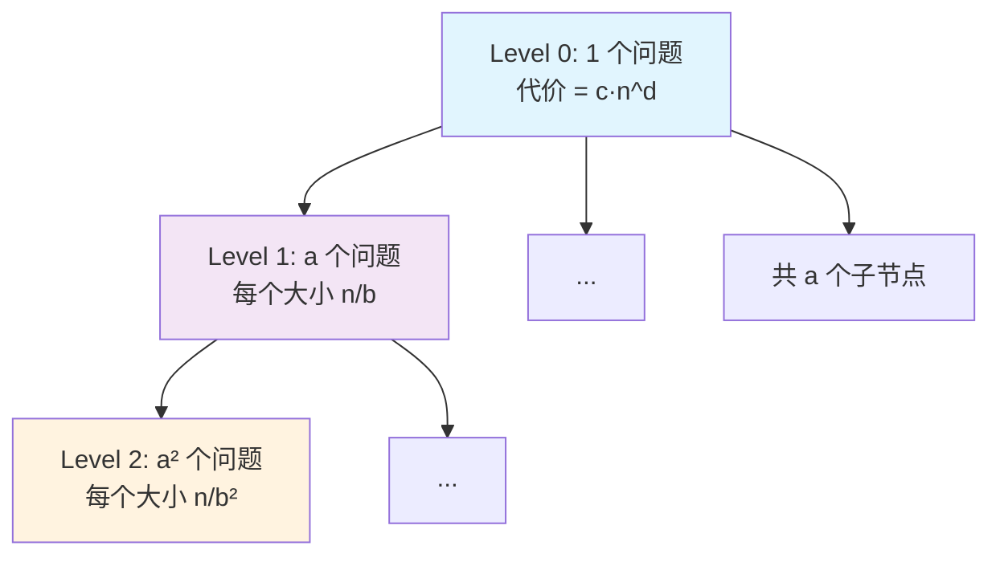

# Chapter 0: 如何使用本教程

> 本章介绍如何借助 Claude Code 获得高效的交互式学习体验。

## 0.1 教程简介

本教程基于 Duke University CS 330: Design & Analysis of Algorithms 课程内容编写，旨在为一对一辅导场景提供系统化的算法学习材料。

## 0.2 如何借助 Claude Code 学习

（待编写）

## 0.3 教程结构说明

本教程共分为 8 章，覆盖以下核心主题：

1. **基础与分治**（Ch1）：算法分析基础、渐近记号、归并排序、快速排序
2. **并行算法**（Ch2）：并行计算模型、Work/Span 分析、算法设计
3. **动态规划**（Ch3）：记忆化、序列比对、矩阵链乘法、树形 DP
4. **图算法**（Ch4）：DFS、BFS、拓扑排序、最短路径
5. **贪心算法**（Ch5）：最小生成树、哈夫曼编码、调度
6. **网络流**（Ch6）：最大流最小割、Ford-Fulkerson、二部图匹配
7. **计算复杂性**（Ch7）：P vs NP、归约、近似算法
8. **大数据算法**（Ch8）：聚类、哈希、草图、流算法

## 0.4 参考资料

- [DPV] Dasgupta, Papadimitriou, Vazirani, *Algorithms* (2006)
- [Er] Erickson, *Algorithms* (2019)

## 0.5 主定理（Master Theorem）速查

主定理是分析分治算法复杂度的核心工具，贯穿本教程多个章节。在此给出完整陈述、证明思路与应用示例，供随时查阅。

### 0.5.1 定理陈述

对于形如

$$
T(n) = a \cdot T\!\left(\frac{n}{b}\right) + O(n^d)
$$

的递推关系，其中 $a \ge 1$，$b > 1$，$d \ge 0$ 为常数，有：

$$
T(n) = \begin{cases}
O(n^d) & \text{if } d > \log_b a \quad \text{（Case 1：合并代价主导）} \\[6pt]
O(n^d \log n) & \text{if } d = \log_b a \quad \text{（Case 2：各层均衡）} \\[6pt]
O(n^{\log_b a}) & \text{if } d < \log_b a \quad \text{（Case 3：叶子代价主导）}
\end{cases}
$$

**直觉理解**：比较"每层合并代价的增长率 $n^d$"与"子问题数量的增长率 $n^{\log_b a}$"，谁增长更快谁就主导总复杂度；若两者持平，则额外乘一个 $\log n$。

### 0.5.2 证明（递归树方法）

将递推关系展开为一棵递归树来分析。

**递归树结构**：



<!-- PROOF_PART2_PLACEHOLDER -->

**逐层分析**：

- **第 $k$ 层**：共有 $a^k$ 个子问题，每个子问题规模为 $n/b^k$
- **第 $k$ 层总代价**：$a^k \cdot c \cdot \left(\frac{n}{b^k}\right)^d = c \cdot n^d \cdot \left(\frac{a}{b^d}\right)^k$
- **树的高度**：当 $n/b^k = 1$ 时，$k = \log_b n$
- **叶子层代价**：$a^{\log_b n} = n^{\log_b a}$（利用 $a^{\log_b n} = n^{\log_b a}$ 的恒等式）

**总代价求和**：

$$
T(n) = c \cdot n^d \sum_{k=0}^{\log_b n} \left(\frac{a}{b^d}\right)^k
$$

令 $r = \frac{a}{b^d}$，这是一个等比级数。根据 $r$ 与 1 的关系分三种情况：

**Case 1**：$d > \log_b a$，即 $b^d > a$，故 $r < 1$。等比级数收敛到常数：

$$
\sum_{k=0}^{\log_b n} r^k = \frac{1 - r^{\log_b n + 1}}{1 - r} = O(1)
$$

因此 $T(n) = O(n^d)$。第 0 层（根节点）的合并代价主导。

**Case 2**：$d = \log_b a$，即 $r = 1$。每层代价相同：

$$
\sum_{k=0}^{\log_b n} 1^k = \log_b n + 1 = O(\log n)
$$

因此 $T(n) = O(n^d \log n)$。每层贡献均等，共 $O(\log n)$ 层。

**Case 3**：$d < \log_b a$，即 $r > 1$。等比级数由最后一项主导：

$$
\sum_{k=0}^{\log_b n} r^k = \frac{r^{\log_b n + 1} - 1}{r - 1} = O(r^{\log_b n}) = O\!\left(\frac{a^{\log_b n}}{b^{d \cdot \log_b n}}\right) = O\!\left(\frac{n^{\log_b a}}{n^d}\right)
$$

因此 $T(n) = O(n^d) \cdot O\!\left(\frac{n^{\log_b a}}{n^d}\right) = O(n^{\log_b a})$。叶子层代价主导。$\blacksquare$

### 0.5.3 应用示例

#### 示例 1：归并排序

$$
T(n) = 2T(n/2) + O(n)
$$

参数：$a = 2$，$b = 2$，$d = 1$。

比较：$\log_b a = \log_2 2 = 1 = d$ → **Case 2**

$$
T(n) = O(n \log n)
$$

#### 示例 2：二分搜索

$$
T(n) = T(n/2) + O(1)
$$

参数：$a = 1$，$b = 2$，$d = 0$。

比较：$\log_b a = \log_2 1 = 0 = d$ → **Case 2**

$$
T(n) = O(\log n)
$$

#### 示例 3：Karatsuba 整数乘法

$$
T(n) = 3T(n/2) + O(n)
$$

参数：$a = 3$，$b = 2$，$d = 1$。

比较：$\log_b a = \log_2 3 \approx 1.585 > 1 = d$ → **Case 3**

$$
T(n) = O(n^{\log_2 3}) \approx O(n^{1.585})
$$

#### 示例 4：朴素矩阵乘法（分治版）

$$
T(n) = 8T(n/2) + O(n^2)
$$

参数：$a = 8$，$b = 2$，$d = 2$。

比较：$\log_b a = \log_2 8 = 3 > 2 = d$ → **Case 3**

$$
T(n) = O(n^3)
$$

#### 示例 5：Strassen 矩阵乘法

$$
T(n) = 7T(n/2) + O(n^2)
$$

参数：$a = 7$，$b = 2$，$d = 2$。

比较：$\log_b a = \log_2 7 \approx 2.807 > 2 = d$ → **Case 3**

$$
T(n) = O(n^{\log_2 7}) \approx O(n^{2.807})
$$

#### 示例 6：某假设算法

$$
T(n) = 4T(n/2) + O(n^3)
$$

参数：$a = 4$，$b = 2$，$d = 3$。

比较：$\log_b a = \log_2 4 = 2 < 3 = d$ → **Case 1**

$$
T(n) = O(n^3)
$$

合并代价 $n^3$ 远超子问题增长速度，根节点层主导。

### 0.5.4 速查表

| 递推关系 | $a$ | $b$ | $d$ | $\log_b a$ | Case | 结果 |
|---------|-----|-----|-----|------------|------|------|
| $T = 2T(n/2) + O(n)$ | 2 | 2 | 1 | 1 | 2 | $O(n\log n)$ |
| $T = T(n/2) + O(1)$ | 1 | 2 | 0 | 0 | 2 | $O(\log n)$ |
| $T = 3T(n/2) + O(n)$ | 3 | 2 | 1 | 1.585 | 3 | $O(n^{1.585})$ |
| $T = 8T(n/2) + O(n^2)$ | 8 | 2 | 2 | 3 | 3 | $O(n^3)$ |
| $T = 7T(n/2) + O(n^2)$ | 7 | 2 | 2 | 2.807 | 3 | $O(n^{2.807})$ |
| $T = 4T(n/2) + O(n^3)$ | 4 | 2 | 3 | 2 | 1 | $O(n^3)$ |
| $T = 2T(n/2) + O(1)$ | 2 | 2 | 0 | 1 | 3 | $O(n)$ |
| $T = 4T(n/2) + O(n^2)$ | 4 | 2 | 2 | 2 | 2 | $O(n^2\log n)$ |

## 0.6 渐近符号（Asymptotic Notation）

渐近符号是算法分析的"通用语言"。本节系统介绍五种渐近记号的定义、性质与使用技巧，并通过测试题帮助你巩固理解。

### 0.6.1 为什么需要渐近符号

分析算法时，我们关心的是：**当输入规模 $n$ 足够大时，算法的运行时间如何增长？**

考虑两个算法的精确运行时间：
- 算法 A：$T_A(n) = 3n^2 + 5n + 100$
- 算法 B：$T_B(n) = 0.5n^3$

当 $n$ 很小时（比如 $n = 2$），$T_A(2) = 122$ 而 $T_B(2) = 4$，算法 B 更快。但当 $n$ 足够大时（比如 $n = 1000$），$T_A = 3{,}005{,}100$ 而 $T_B = 500{,}000{,}000$，算法 A 快了两个数量级。

**关键观察**：当 $n \to \infty$ 时，决定增长速度的是**最高次项**，常数因子和低阶项的影响可以忽略。

忽略常数因子和低阶项是合理的，因为：
1. **常数因子依赖于具体实现**：同一算法在不同机器、不同编程语言上的常数因子不同
2. **低阶项在 $n$ 大时可忽略**：$3n^2 + 5n$ 中，当 $n = 1000$ 时，$5n$ 仅占总量的 $0.17\%$
3. **我们关心的是增长趋势**：$n^2$ 和 $n^3$ 的差异远比 $3n^2$ 和 $5n^2$ 的差异重要

渐近符号正是将这种"忽略常数和低阶项，只关注增长趋势"的思想形式化的数学工具。

### 0.6.2 大 O 记号（$O$）— 渐近上界

**定义**：$f(n) = O(g(n))$ 当且仅当存在正常数 $c > 0$ 和 $n_0 > 0$，使得对所有 $n \ge n_0$，有

$$
f(n) \le c \cdot g(n)
$$

**直觉**：$f(n) = O(g(n))$ 表示 $f$ 的增长速度**不超过** $g$（在常数因子意义下）。$g(n)$ 是 $f(n)$ 的一个渐近上界。

> **注意**：严格来说，$f(n) = O(g(n))$ 中的 "$=$" 不是通常意义的等号，而是表示 "$f(n)$ 属于 $O(g(n))$ 这个函数集合"。写成 $f(n) \in O(g(n))$ 更准确，但 "$=$" 的写法已成为惯例。

**示例**：证明 $3n^2 + 5n + 2 = O(n^2)$。

**证明**：需要找到 $c$ 和 $n_0$ 使得 $3n^2 + 5n + 2 \le c \cdot n^2$ 对所有 $n \ge n_0$ 成立。

当 $n \ge 1$ 时：
$$
3n^2 + 5n + 2 \le 3n^2 + 5n^2 + 2n^2 = 10n^2
$$

取 $c = 10$，$n_0 = 1$，则对所有 $n \ge 1$，$3n^2 + 5n + 2 \le 10n^2$。$\blacksquare$

**更多示例**：
- $100n + 500 = O(n)$（取 $c = 600, n_0 = 1$）
- $n = O(n^2)$（上界可以不紧）
- $\log_2 n = O(\log_{10} n)$（对数换底只差常数因子，所以 $O(\log n)$ 中底数无关紧要）

### 0.6.3 大 Ω 记号（$\Omega$）— 渐近下界

**定义**：$f(n) = \Omega(g(n))$ 当且仅当存在正常数 $c > 0$ 和 $n_0 > 0$，使得对所有 $n \ge n_0$，有

$$
f(n) \ge c \cdot g(n)
$$

**直觉**：$f(n) = \Omega(g(n))$ 表示 $f$ 的增长速度**至少为** $g$（在常数因子意义下）。$g(n)$ 是 $f(n)$ 的一个渐近下界。

**与 $O$ 的对称关系**：

$$
f(n) = O(g(n)) \iff g(n) = \Omega(f(n))
$$

也就是说，$O$ 和 $\Omega$ 互为"镜像"关系。

**示例**：证明 $3n^2 + 5n + 2 = \Omega(n^2)$。

**证明**：当 $n \ge 1$ 时，$3n^2 + 5n + 2 \ge 3n^2$。取 $c = 3$，$n_0 = 1$。$\blacksquare$

**更多示例**：
- $n^3 = \Omega(n^2)$（下界可以不紧）
- $n\log n = \Omega(n)$

### 0.6.4 大 Θ 记号（$\Theta$）— 渐近紧界

**定义**：$f(n) = \Theta(g(n))$ 当且仅当 $f(n) = O(g(n))$ **且** $f(n) = \Omega(g(n))$。

等价地：存在正常数 $c_1, c_2 > 0$ 和 $n_0 > 0$，使得对所有 $n \ge n_0$，有

$$
c_1 \cdot g(n) \le f(n) \le c_2 \cdot g(n)
$$

**直觉**：$f(n) = \Theta(g(n))$ 表示 $f$ 和 $g$ 的增长速度**相同**（在常数因子意义下）。$\Theta$ 给出的是"精确"的渐近增长率。

**示例**：证明 $3n^2 + 5n + 2 = \Theta(n^2)$。

**证明**：
- 上界：已在 0.6.2 中证明 $3n^2 + 5n + 2 = O(n^2)$（$c_2 = 10, n_0 = 1$）
- 下界：已在 0.6.3 中证明 $3n^2 + 5n + 2 = \Omega(n^2)$（$c_1 = 3, n_0 = 1$）

因此 $3n^2 + 5n + 2 = \Theta(n^2)$。$\blacksquare$

> **实践建议**：在算法分析中，如果能给出 $\Theta$ 界，就优先使用 $\Theta$，因为它最精确。只有在只能确定上界或下界时，才退而使用 $O$ 或 $\Omega$。

### 0.6.5 小 $o$ 和小 $\omega$ 记号

大 $O$ 和大 $\Omega$ 允许"等于"的情况（如 $n^2 = O(n^2)$）。小 $o$ 和小 $\omega$ 则排除了"等于"，表示**严格**的渐近关系。

**小 $o$ 的定义**：$f(n) = o(g(n))$ 当且仅当对**任意**正常数 $c > 0$，都存在 $n_0 > 0$，使得对所有 $n \ge n_0$，有

$$
f(n) < c \cdot g(n)
$$

等价的极限定义：

$$
f(n) = o(g(n)) \iff \lim_{n \to \infty} \frac{f(n)}{g(n)} = 0
$$

**直觉**：$f(n) = o(g(n))$ 表示 $f$ 的增长速度**严格慢于** $g$。

**小 $\omega$ 的定义**：$f(n) = \omega(g(n))$ 当且仅当对**任意**正常数 $c > 0$，都存在 $n_0 > 0$，使得对所有 $n \ge n_0$，有

$$
f(n) > c \cdot g(n)
$$

等价的极限定义：

$$
f(n) = \omega(g(n)) \iff \lim_{n \to \infty} \frac{f(n)}{g(n)} = \infty
$$

**直觉**：$f(n) = \omega(g(n))$ 表示 $f$ 的增长速度**严格快于** $g$。

**五种记号的类比**：

| 渐近记号 | 类比关系 | 含义 |
|---------|---------|------|
| $f = O(g)$ | $f \le g$ | $f$ 增长不超过 $g$ |
| $f = \Omega(g)$ | $f \ge g$ | $f$ 增长不低于 $g$ |
| $f = \Theta(g)$ | $f = g$ | $f$ 与 $g$ 增长相同 |
| $f = o(g)$ | $f < g$ | $f$ 增长严格慢于 $g$ |
| $f = \omega(g)$ | $f > g$ | $f$ 增长严格快于 $g$ |

**示例**：
- $n = o(n^2)$，因为 $\lim_{n\to\infty} \frac{n}{n^2} = \lim_{n\to\infty} \frac{1}{n} = 0$
- $n^2 = \omega(n)$，因为 $\lim_{n\to\infty} \frac{n^2}{n} = \lim_{n\to\infty} n = \infty$
- $n^2 \ne o(n^2)$，因为 $\lim_{n\to\infty} \frac{n^2}{n^2} = 1 \ne 0$（大 $O$ 成立但小 $o$ 不成立）

### 0.6.6 常见增长率排序

以下函数按增长速度从慢到快排列（$n \to \infty$ 时）：

$$
1 \ll \log\log n \ll \log n \ll \sqrt{n} \ll n \ll n\log n \ll n^2 \ll n^3 \ll 2^n \ll n! \ll n^n
$$

其中 $f \ll g$ 表示 $f = o(g)$。

| 增长率 | 名称 | 典型算法 | $n = 10^6$ 时的量级 |
|-------|------|---------|-------------------|
| $O(1)$ | 常数 | 哈希表查找 | $1$ |
| $O(\log n)$ | 对数 | 二分搜索 | $\approx 20$ |
| $O(\sqrt{n})$ | 平方根 | 试除法判素数 | $1000$ |
| $O(n)$ | 线性 | 线性扫描 | $10^6$ |
| $O(n\log n)$ | 线性对数 | 归并排序 | $\approx 2 \times 10^7$ |
| $O(n^2)$ | 平方 | 冒泡排序 | $10^{12}$ |
| $O(n^3)$ | 立方 | 朴素矩阵乘法 | $10^{18}$ |
| $O(2^n)$ | 指数 | 穷举子集 | $\approx 10^{301029}$ |
| $O(n!)$ | 阶乘 | 穷举排列 | 天文数字 |

> **关键直觉**：多项式增长（$n^k$）和指数增长（$c^n$）之间有巨大鸿沟。$n^{100}$ 虽然增长很快，但仍然远慢于 $1.01^n$（当 $n$ 足够大时）。这一差异是计算复杂性理论中 P vs NP 问题的核心。

### 0.6.7 渐近符号的运算规则

掌握以下规则可以大大简化渐近分析。

**加法规则（取最大项）**：

$$
O(f(n)) + O(g(n)) = O(\max(f(n), g(n)))
$$

例如：$O(n^2) + O(n) = O(n^2)$。

直觉：两段代码串行执行，总时间由较慢的那段决定。

**乘法规则**：

$$
O(f(n)) \cdot O(g(n)) = O(f(n) \cdot g(n))
$$

例如：一个 $O(n)$ 的循环内嵌套一个 $O(\log n)$ 的操作，总复杂度为 $O(n\log n)$。

**常数因子规则**：

$$
O(c \cdot f(n)) = O(f(n)) \quad \text{（$c > 0$ 为常数）}
$$

**传递性**：

$$
f = O(g) \text{ 且 } g = O(h) \implies f = O(h)
$$

对 $\Omega$、$\Theta$、$o$、$\omega$ 同样成立。

**对称性**：

$$
f = \Theta(g) \iff g = \Theta(f)
$$

**转置对称性**：

$$
f = O(g) \iff g = \Omega(f)
$$

$$
f = o(g) \iff g = \omega(f)
$$

### 0.6.8 实用技巧与常见陷阱

#### 极限法判断渐近关系

对于"好"的函数（连续、最终单调），可以用极限来判断渐近关系：

$$
\lim_{n \to \infty} \frac{f(n)}{g(n)} = \begin{cases}
0 & \implies f = o(g)，从而 f = O(g) \\\\[4pt]
c \in (0, \infty) & \implies f = \Theta(g) \\\\[4pt]
\infty & \implies f = \omega(g)，从而 f = \Omega(g)
\end{cases}
$$

**示例**：判断 $n\log n$ 与 $n^{1.5}$ 的关系。

$$
\lim_{n \to \infty} \frac{n\log n}{n^{1.5}} = \lim_{n \to \infty} \frac{\log n}{\sqrt{n}} = 0 \quad \text{（对数增长慢于任何多项式）}
$$

因此 $n\log n = o(n^{1.5})$。

> **有用的极限事实**：
> - $\lim_{n\to\infty} \frac{(\log n)^k}{n^\epsilon} = 0$，对任意常数 $k > 0$ 和 $\epsilon > 0$（对数增长慢于任何多项式）
> - $\lim_{n\to\infty} \frac{n^k}{c^n} = 0$，对任意常数 $k > 0$ 和 $c > 1$（多项式增长慢于任何指数）
> - Stirling 近似：$n! \approx \sqrt{2\pi n} \left(\frac{n}{e}\right)^n$，因此 $\log(n!) = \Theta(n\log n)$

#### 常见陷阱

**陷阱 1：混淆 $O$ 和 $\Theta$**

$O$ 只是上界，不代表紧界。说"归并排序的时间复杂度是 $O(n^3)$"在技术上没错，但毫无意义——正确的表述是 $\Theta(n\log n)$。

**陷阱 2：$O$ 用于上界，不是"平均情况"**

常见误解：$O$ 表示最坏情况，$\Omega$ 表示最好情况。**这是错误的。** $O$、$\Omega$、$\Theta$ 描述的是函数的增长率，与最坏/最好/平均情况无关。例如，可以说"快速排序的最坏情况时间是 $\Theta(n^2)$"，也可以说"快速排序的平均情况时间是 $\Theta(n\log n)$"。

**陷阱 3：忘记 $O$ 的定义中 $n_0$ 的作用**

$3n + 100 = O(n)$ 是正确的，即使当 $n = 1$ 时 $3 \cdot 1 + 100 = 103 > c \cdot 1$（对于小的 $c$）。渐近符号只关心 $n$ 足够大之后的行为。

**陷阱 4：对数的底数**

在渐近分析中，$\log$ 的底数不重要，因为 $\log_a n = \frac{\log_b n}{\log_b a}$，底数转换只差一个常数因子。所以我们通常直接写 $O(\log n)$ 而不指定底数。

但注意：**指数的底数很重要！** $2^n \ne O(3^n)$ 的反方向不成立（$3^n \ne O(2^n)$）。

### 0.6.9 测试题

以下题目帮助你检验对渐近符号的理解。建议先独立思考，再查看答案。

---

**题目 1**（判断题）：以下渐近关系是否成立？回答"成立"或"不成立"。

(a) $n^2 + 10n = O(n^2)$

(b) $n^2 = O(n)$

(c) $2^{n+1} = O(2^n)$

(d) $2^{2n} = O(2^n)$

(e) $\log(n!) = O(n\log n)$

(f) $n = \Omega(n^2)$

<details>
<summary><b>答案与解析</b></summary>

**(a) 成立。** 当 $n \ge 10$ 时，$n^2 + 10n \le n^2 + n \cdot n = 2n^2$。取 $c = 2, n_0 = 10$。

**(b) 不成立。** 假设 $n^2 \le cn$，则 $n \le c$，但 $n$ 可以任意大，矛盾。

**(c) 成立。** $2^{n+1} = 2 \cdot 2^n$。取 $c = 2, n_0 = 1$。常数因子被 $O$ 吸收。

**(d) 不成立。** $2^{2n} = (2^n)^2 = 4^n$。若 $4^n \le c \cdot 2^n$，则 $2^n \le c$，但 $2^n$ 可以任意大，矛盾。

**(e) 成立。** 由 Stirling 近似，$\log(n!) = \Theta(n\log n)$，因此当然 $= O(n\log n)$。也可直接证明：$\log(n!) = \sum_{i=1}^{n}\log i \le \sum_{i=1}^{n}\log n = n\log n$。

**(f) 不成立。** $\Omega(n^2)$ 要求 $n \ge cn^2$，即 $1 \ge cn$，当 $n$ 足够大时不可能成立。实际上 $n = O(n^2)$，方向相反。

</details>

---

**题目 2**（排序题）：将以下函数按增长率从慢到快排列。

$$
n^2, \quad 2^n, \quad n\log n, \quad \log n, \quad n^{1.5}, \quad n!, \quad 1, \quad \sqrt{\log n}
$$

<details>
<summary><b>答案与解析</b></summary>

$$
1 \ll \sqrt{\log n} \ll \log n \ll n\log n \ll n^{1.5} \ll n^2 \ll 2^n \ll n!
$$

解析：
- $1$ 是常数，增长最慢
- $\sqrt{\log n}$ 和 $\log n$ 都是对数级别，$\sqrt{\log n} = o(\log n)$
- $n\log n$ 比 $n^{1.5}$ 慢，因为 $\log n = o(n^{0.5})$（对数慢于任何多项式）
- $n^{1.5}$ 比 $n^2$ 慢（指数 $1.5 < 2$）
- $n^2$ 比 $2^n$ 慢（多项式慢于指数）
- $2^n$ 比 $n!$ 慢（可由 Stirling 近似证明）

</details>

---

**题目 3**（证明题）：证明 $5n^3 + 2n^2 + n + 100 = \Theta(n^3)$。

<details>
<summary><b>答案与解析</b></summary>

**上界**：当 $n \ge 1$ 时，
$$
5n^3 + 2n^2 + n + 100 \le 5n^3 + 2n^3 + n^3 + 100n^3 = 108n^3
$$
取 $c_2 = 108, n_0 = 1$，得 $5n^3 + 2n^2 + n + 100 = O(n^3)$。

**下界**：当 $n \ge 1$ 时，
$$
5n^3 + 2n^2 + n + 100 \ge 5n^3
$$
取 $c_1 = 5, n_0 = 1$，得 $5n^3 + 2n^2 + n + 100 = \Omega(n^3)$。

综合得 $5n^3 + 2n^2 + n + 100 = \Theta(n^3)$。$\blacksquare$

</details>

---

**题目 4**（极限法）：判断 $(\log n)^{10}$ 与 $n^{0.1}$ 的渐近关系。

<details>
<summary><b>答案与解析</b></summary>

计算极限：
$$
\lim_{n \to \infty} \frac{(\log n)^{10}}{n^{0.1}}
$$

令 $m = \log n$（即 $n = 2^m$），则：
$$
\lim_{m \to \infty} \frac{m^{10}}{2^{0.1m}} = 0
$$

因为指数函数 $2^{0.1m}$ 增长远快于多项式 $m^{10}$。

因此 $(\log n)^{10} = o(n^{0.1})$。

**启示**：无论对数的幂次多高，它的增长都慢于 $n$ 的任何正次幂。这就是"对数增长慢于任何多项式"的精确含义。

</details>

---

**题目 5**（陷阱题）：以下说法哪些是正确的？

(a) 如果 $f(n) = O(g(n))$，则 $g(n) = O(f(n))$

(b) 如果 $f(n) = O(g(n))$，则 $g(n) = \Omega(f(n))$

(c) $O(n^2) + O(n^2) = O(n^4)$

(d) 对所有函数 $f(n)$ 和 $g(n)$，必有 $f(n) = O(g(n))$ 或 $g(n) = O(f(n))$（至少一个成立）

<details>
<summary><b>答案与解析</b></summary>

**(a) 不正确。** 反例：$n = O(n^2)$，但 $n^2 \ne O(n)$。$O$ 不具有对称性。

**(b) 正确。** 这是转置对称性：$f \le cg \iff g \ge \frac{1}{c}f$。

**(c) 不正确（虽然技术上成立，但不是紧界）。** $O(n^2) + O(n^2) = O(n^2)$，不是 $O(n^4)$。加法取最大项，不是乘法。虽然 $O(n^2) \subseteq O(n^4)$，所以说 $= O(n^4)$ 在技术上没错，但这是一个非常松的上界，实践中应该写 $O(n^2)$。

**(d) 不正确。** 考虑 $f(n) = n$ 和 $g(n) = n^{1+\sin n}$。由于 $\sin n$ 在 $-1$ 和 $1$ 之间振荡，$g(n)$ 有时比 $f(n)$ 大（当 $\sin n$ 接近 $1$ 时），有时比 $f(n)$ 小（当 $\sin n$ 接近 $-1$ 时），两个方向的 $O$ 关系都不成立。

</details>

---

**题目 6**（综合题）：对于以下每对函数，判断 $f(n)$ 与 $g(n)$ 之间的关系（$O$、$\Omega$、$\Theta$、$o$、$\omega$ 中哪些成立）。

| | $f(n)$ | $g(n)$ |
|---|--------|--------|
| (a) | $n^2$ | $n^3$ |
| (b) | $2^n$ | $3^n$ |
| (c) | $n\log n$ | $n\sqrt{\log n}$ |
| (d) | $\log(n^2)$ | $\log(n^3)$ |

<details>
<summary><b>答案与解析</b></summary>

**(a)** $f = o(g)$，因此 $f = O(g)$。同时 $g = \omega(f)$，$g = \Omega(f)$。$\Theta$ 不成立。

验证：$\lim \frac{n^2}{n^3} = \lim \frac{1}{n} = 0$。

**(b)** $f = o(g)$，因此 $f = O(g)$。$\Theta$ 不成立。

验证：$\lim \frac{2^n}{3^n} = \lim \left(\frac{2}{3}\right)^n = 0$。注意 $2^n$ 和 $3^n$ 虽然都是指数函数，但底数不同意味着增长率不同！

**(c)** $f = \omega(g)$，因此 $f = \Omega(g)$。$\Theta$ 不成立。

验证：$\frac{n\log n}{n\sqrt{\log n}} = \frac{\log n}{\sqrt{\log n}} = \sqrt{\log n} \to \infty$。

**(d)** $f = \Theta(g)$（因此 $O$、$\Omega$ 也成立）。$o$ 和 $\omega$ 不成立。

验证：$\log(n^2) = 2\log n$，$\log(n^3) = 3\log n$。$\frac{2\log n}{3\log n} = \frac{2}{3}$，极限为常数。

</details>

---

**题目 7**（代码分析题）：分析以下 Python 代码的时间复杂度。

```python
def mystery(n):
    total = 0
    i = 1
    while i < n:
        j = 0
        while j < n:
            total += 1
            j += 1
        i *= 2
    return total
```

<details>
<summary><b>答案与解析</b></summary>

外层循环：$i$ 从 $1$ 开始，每次乘以 $2$，直到 $i \ge n$。因此外层循环执行 $\lceil\log_2 n\rceil$ 次。

内层循环：每次执行 $n$ 次。

总时间复杂度：$\Theta(n\log n)$。

注意：虽然外层循环看起来"不标准"（$i$ 不是每次加 $1$），但这正是对数级循环的典型模式。

</details>

---

**题目 8**（挑战题）：证明或反驳：$\max(f(n), g(n)) = \Theta(f(n) + g(n))$，其中 $f(n) \ge 0$ 且 $g(n) \ge 0$。

<details>
<summary><b>答案与解析</b></summary>

**成立。** 证明如下：

**上界**：$\max(f, g) \le f + g$（显然，因为 $f \ge 0, g \ge 0$）。

因此 $\max(f, g) = O(f + g)$，取 $c = 1$。

**下界**：$\max(f, g) \ge \frac{1}{2}(f + g)$（因为 $\max(f,g) \ge f$ 且 $\max(f,g) \ge g$，两式相加得 $2\max(f,g) \ge f + g$）。

因此 $\max(f, g) = \Omega(f + g)$，取 $c = \frac{1}{2}$。

综合得 $\max(f(n), g(n)) = \Theta(f(n) + g(n))$。$\blacksquare$

**意义**：这个结论解释了为什么加法规则 $O(f) + O(g) = O(\max(f, g))$ 成立——因为 $f + g$ 和 $\max(f, g)$ 在渐近意义下是等价的。

</details>
