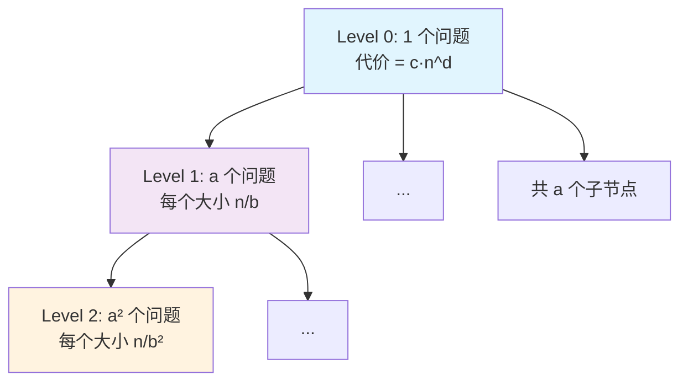

# Chapter 0: 如何使用本教程

> 本章介绍如何借助 Claude Code 获得高效的交互式学习体验。

## 0.1 教程简介

本教程基于 Duke University CS 330: Design & Analysis of Algorithms 课程内容编写，旨在为一对一辅导场景提供系统化的算法学习材料。

## 0.2 如何借助 Claude Code 学习

（待编写）

## 0.3 教程结构说明

本教程共分为 8 章，覆盖以下核心主题：

1. **基础与分治**（Ch1）：算法分析基础、渐近记号、归并排序、快速排序
2. **并行算法**（Ch2）：并行计算模型、Work/Span 分析、算法设计
3. **动态规划**（Ch3）：记忆化、序列比对、矩阵链乘法、树形 DP
4. **图算法**（Ch4）：DFS、BFS、拓扑排序、最短路径
5. **贪心算法**（Ch5）：最小生成树、哈夫曼编码、调度
6. **网络流**（Ch6）：最大流最小割、Ford-Fulkerson、二部图匹配
7. **计算复杂性**（Ch7）：P vs NP、归约、近似算法
8. **大数据算法**（Ch8）：聚类、哈希、草图、流算法

## 0.4 参考资料

- [DPV] Dasgupta, Papadimitriou, Vazirani, *Algorithms* (2006)
- [Er] Erickson, *Algorithms* (2019)

## 0.5 主定理（Master Theorem）速查

主定理是分析分治算法复杂度的核心工具，贯穿本教程多个章节。在此给出完整陈述、证明思路与应用示例，供随时查阅。

### 0.5.1 定理陈述

对于形如

$$
T(n) = a \cdot T\!\left(\frac{n}{b}\right) + O(n^d)
$$

的递推关系，其中 $a \ge 1$，$b > 1$，$d \ge 0$ 为常数，有：

$$
T(n) = \begin{cases}
O(n^d) & \text{if } d > \log_b a \quad \text{（Case 1：合并代价主导）} \\[6pt]
O(n^d \log n) & \text{if } d = \log_b a \quad \text{（Case 2：各层均衡）} \\[6pt]
O(n^{\log_b a}) & \text{if } d < \log_b a \quad \text{（Case 3：叶子代价主导）}
\end{cases}
$$

**直觉理解**：比较"每层合并代价的增长率 $n^d$"与"子问题数量的增长率 $n^{\log_b a}$"，谁增长更快谁就主导总复杂度；若两者持平，则额外乘一个 $\log n$。

### 0.5.2 证明（递归树方法）

将递推关系展开为一棵递归树来分析。

**递归树结构**：

<!-- PROOF_PART2_PLACEHOLDER -->

**逐层分析**：

- **第 $k$ 层**：共有 $a^k$ 个子问题，每个子问题规模为 $n/b^k$
- **第 $k$ 层总代价**：$a^k \cdot c \cdot \left(\frac{n}{b^k}\right)^d = c \cdot n^d \cdot \left(\frac{a}{b^d}\right)^k$
- **树的高度**：当 $n/b^k = 1$ 时，$k = \log_b n$
- **叶子层代价**：$a^{\log_b n} = n^{\log_b a}$（利用 $a^{\log_b n} = n^{\log_b a}$ 的恒等式）

**总代价求和**：

$$
T(n) = c \cdot n^d \sum_{k=0}^{\log_b n} \left(\frac{a}{b^d}\right)^k
$$

令 $r = \frac{a}{b^d}$，这是一个等比级数。根据 $r$ 与 1 的关系分三种情况：

**Case 1**：$d > \log_b a$，即 $b^d > a$，故 $r < 1$。等比级数收敛到常数：

$$
\sum_{k=0}^{\log_b n} r^k = \frac{1 - r^{\log_b n + 1}}{1 - r} = O(1)
$$

因此 $T(n) = O(n^d)$。第 0 层（根节点）的合并代价主导。

**Case 2**：$d = \log_b a$，即 $r = 1$。每层代价相同：

$$
\sum_{k=0}^{\log_b n} 1^k = \log_b n + 1 = O(\log n)
$$

因此 $T(n) = O(n^d \log n)$。每层贡献均等，共 $O(\log n)$ 层。

**Case 3**：$d < \log_b a$，即 $r > 1$。等比级数由最后一项主导：

$$
\sum_{k=0}^{\log_b n} r^k = \frac{r^{\log_b n + 1} - 1}{r - 1} = O(r^{\log_b n}) = O\!\left(\frac{a^{\log_b n}}{b^{d \cdot \log_b n}}\right) = O\!\left(\frac{n^{\log_b a}}{n^d}\right)
$$

因此 $T(n) = O(n^d) \cdot O\!\left(\frac{n^{\log_b a}}{n^d}\right) = O(n^{\log_b a})$。叶子层代价主导。$\blacksquare$

### 0.5.3 应用示例

#### 示例 1：归并排序

$$
T(n) = 2T(n/2) + O(n)
$$

参数：$a = 2$，$b = 2$，$d = 1$。

比较：$\log_b a = \log_2 2 = 1 = d$ → **Case 2**

$$
T(n) = O(n \log n)
$$

#### 示例 2：二分搜索

$$
T(n) = T(n/2) + O(1)
$$

参数：$a = 1$，$b = 2$，$d = 0$。

比较：$\log_b a = \log_2 1 = 0 = d$ → **Case 2**

$$
T(n) = O(\log n)
$$

#### 示例 3：Karatsuba 整数乘法

$$
T(n) = 3T(n/2) + O(n)
$$

参数：$a = 3$，$b = 2$，$d = 1$。

比较：$\log_b a = \log_2 3 \approx 1.585 > 1 = d$ → **Case 3**

$$
T(n) = O(n^{\log_2 3}) \approx O(n^{1.585})
$$

#### 示例 4：朴素矩阵乘法（分治版）

$$
T(n) = 8T(n/2) + O(n^2)
$$

参数：$a = 8$，$b = 2$，$d = 2$。

比较：$\log_b a = \log_2 8 = 3 > 2 = d$ → **Case 3**

$$
T(n) = O(n^3)
$$

#### 示例 5：Strassen 矩阵乘法

$$
T(n) = 7T(n/2) + O(n^2)
$$

参数：$a = 7$，$b = 2$，$d = 2$。

比较：$\log_b a = \log_2 7 \approx 2.807 > 2 = d$ → **Case 3**

$$
T(n) = O(n^{\log_2 7}) \approx O(n^{2.807})
$$

#### 示例 6：某假设算法

$$
T(n) = 4T(n/2) + O(n^3)
$$

参数：$a = 4$，$b = 2$，$d = 3$。

比较：$\log_b a = \log_2 4 = 2 < 3 = d$ → **Case 1**

$$
T(n) = O(n^3)
$$

合并代价 $n^3$ 远超子问题增长速度，根节点层主导。

### 0.5.4 速查表

| 递推关系 | $a$ | $b$ | $d$ | $\log_b a$ | Case | 结果 |
|---------|-----|-----|-----|------------|------|------|
| $T = 2T(n/2) + O(n)$ | 2 | 2 | 1 | 1 | 2 | $O(n\log n)$ |
| $T = T(n/2) + O(1)$ | 1 | 2 | 0 | 0 | 2 | $O(\log n)$ |
| $T = 3T(n/2) + O(n)$ | 3 | 2 | 1 | 1.585 | 3 | $O(n^{1.585})$ |
| $T = 8T(n/2) + O(n^2)$ | 8 | 2 | 2 | 3 | 3 | $O(n^3)$ |
| $T = 7T(n/2) + O(n^2)$ | 7 | 2 | 2 | 2.807 | 3 | $O(n^{2.807})$ |
| $T = 4T(n/2) + O(n^3)$ | 4 | 2 | 3 | 2 | 1 | $O(n^3)$ |
| $T = 2T(n/2) + O(1)$ | 2 | 2 | 0 | 1 | 3 | $O(n)$ |
| $T = 4T(n/2) + O(n^2)$ | 4 | 2 | 2 | 2 | 2 | $O(n^2\log n)$ |
