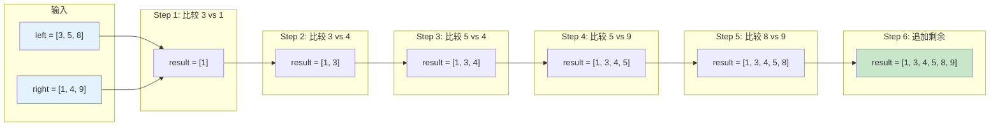
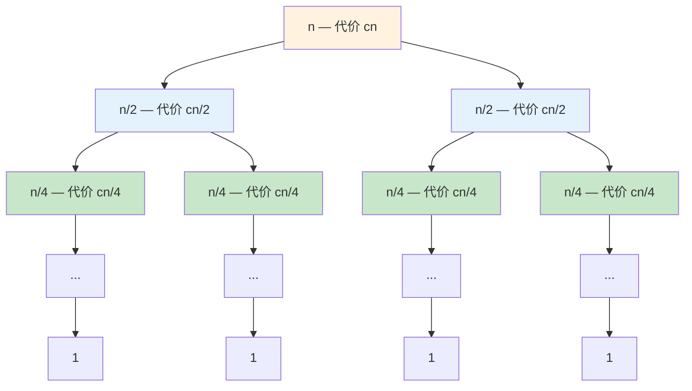
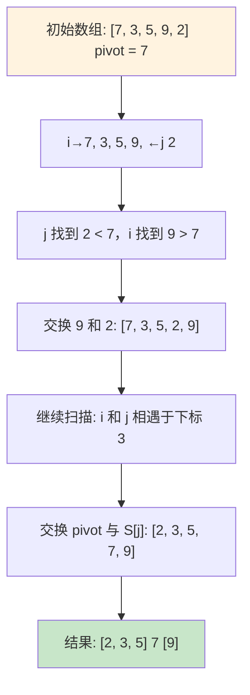
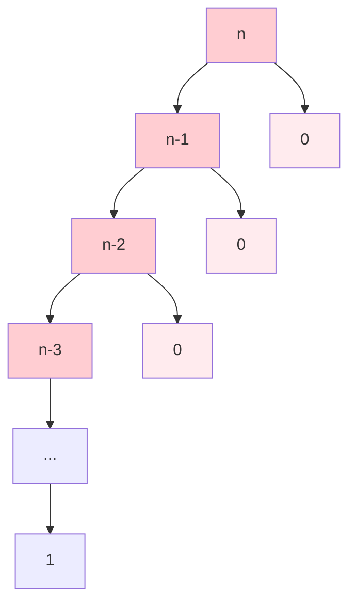
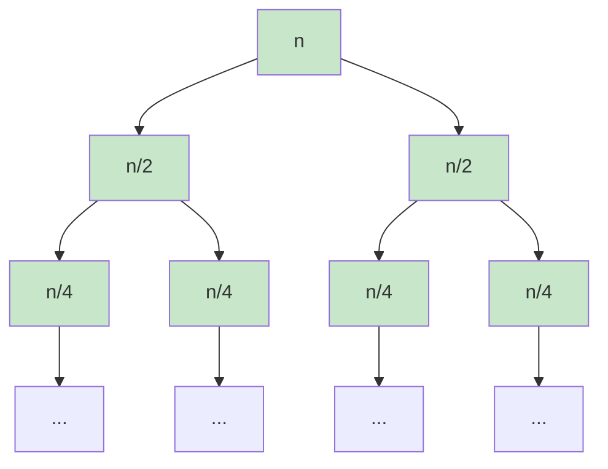

# Chapter 1: 基础与分治

> 对应课程 L02-L03：归并排序、快速排序与随机化

---

## 1.1 分治法范式 (The Divide and Conquer Paradigm)
**核心概念：** 分治法（Divide and Conquer）是算法设计中的一种基础且强大的策略。其核心思想并非直接解决一个庞大的复杂问题，而是将其拆解。正如 Lecture 02 所述，分治法包含三个关键步骤：

1. **Divide (分):** 将原问题（Problem）划分成若干个规模更小的子问题（Subproblems）。
2. **Conquer (治):** 递归地（Recursively）解决这些子问题。如果子问题的规模足够小（Base Case），则直接求解。
3. **Combine (合):** 将子问题的解合并（Merge），从而得到原问题的解。
在排序算法中，**Merge Sort** 和 **Quick Sort** 是这一范式的两个经典应用，但它们在“分”与“合”的侧重点上截然不同：

- **Merge Sort:** 困难在于"合"（Combine/Merge），"分"很简单（直接切半）。
- **Quick Sort:** 困难在于"分"（Partition），"合"很简单（不需要操作）。

下表对比了两种经典分治排序算法的核心差异：

| 特性 | Merge Sort | Quick Sort |
|------|-----------|------------|
| **分 (Divide)** | 简单：直接从中间切半 | 复杂：需要 Partition 过程 |
| **治 (Conquer)** | 递归排序两个子数组 | 递归排序两个子数组 |
| **合 (Combine)** | 复杂：需要 Merge 过程 | 简单：无需操作 |
| **最坏时间** | $O(n \log n)$ | $O(n^2)$ |
| **平均时间** | $O(n \log n)$ | $O(n \log n)$ |
| **额外空间** | $O(n)$ | $O(\log n)$（递归栈） |
| **稳定性** | 稳定 | 不稳定 |
| **原址排序** | 否 | 是 |

---

## 1.2 归并排序 (Merge Sort)
归并排序是一种**稳定**的排序算法，其最坏情况时间复杂度严格为 $O(n \log n)$。

### 1.2.1 算法逻辑与伪代码 (Python Style)
Merge Sort 的主要逻辑是将数组一分为二，分别排序，然后将两个有序数组合并。
**主函数：MergeSort**

```python
def merge_sort(S):
    """
    输入: 数组 S, 长度为 n
    输出: 有序数组 S
    """
    n = len(S)
    # Base Case: 如果数组只有一个元素或为空，直接返回
    if n <= 1:
        return S
    
    # Divide: 找到中间点 m
    m = n // 2  # integer division
    
    # Recurse: 递归解决左右两半
    # 注意: S[0:m] 不包含下标 m，S[m:n] 从 m 开始
    left_sorted = merge_sort(S[0:m])
    right_sorted = merge_sort(S[m:n])
    
    # Combine: 合并两个有序数组
    return merge(left_sorted, right_sorted)

```
**核心过程：Merge (合并)**
Merge 过程需要借助额外空间（Temporary Array）来暂存合并后的结果。



> **图示说明：** 两个有序数组 `left=[3,5,8]` 和 `right=[1,4,9]` 的合并过程。每一步比较两个数组当前指针所指的元素，将较小者放入 `result`。当一个数组遍历完毕后，将另一个数组的剩余元素直接追加。

```python
def merge(left, right):
    """
    输入: 两个有序数组 left, right
    输出: 一个合并后的有序数组 result
    """
    result = []
    i = 0  # 指向 left 的指针
    j = 0  # 指向 right 的指针
    
    # 只要两个数组都还有元素，就比较头部元素
    while i < len(left) and j < len(right):
        if left[i] <= right[j]:
            result.append(left[i])
            i += 1
        else:
            result.append(right[j])
            j += 1
    
    # 如果 left 还有剩余，全部追加到 result
    while i < len(left):
        result.append(left[i])
        i += 1
        
    # 如果 right 还有剩余，全部追加到 result
    while j < len(right):
        result.append(right[j])
        j += 1
        
    return result

```

### 1.2.2 正确性证明 (Correctness Proof)
我们需要证明 `Merge` 过程能够正确地将两个有序数组合并成一个有序数组。
**命题 (Claim):** `Merge` 过程结束时，`result` 数组包含 `left` 和 `right` 中的所有元素，且按非递减顺序排列。

**证明 (Induction):**
我们对**剩余待处理的元素总数**$k$ 进行归纳证明。设 $k = (\text{len}(left) - i) + (\text{len}(right) - j)$。

1. **Base Case (基础情况):**
当 $k=0$ 时，两个数组都已遍历完毕，`result` 已经包含了所有元素。由于之前的每一步都保证了放入 `result` 的元素是当前最小的，且 `result` 也是有序的，故成立。
2. **Inductive Hypothesis (归纳假设):**
假设当剩余元素个数为 $k-1$ 时，算法能正确合并剩余部分。
3. **Inductive Step (归纳步骤):**
考虑当前剩余 $k$ 个元素。算法比较 `left[i]` 和 `right[j]`。
  - 假设 `left[i]` 更小（或相等）。算法将 `left[i]` 放入 `result`，并将 $i$ 增加 1。
  - 此时，剩余元素个数变为 $k-1$。
  - 因为 `left` 和 `right` 本身是有序的，`left[i]` 是剩余所有元素中最小的（它是 `left` 中最小的，且比 `right` 中最小的还小）。
  - 根据归纳假设，算法能正确处理剩余的 $k-1$ 个元素。
  - 因此，我们将当前全局最小的元素放入了正确的位置，并正确解决了剩余问题，故整体正确。

### 1.2.3 时间复杂度分析 (Time Complexity Analysis)
我们通过**递归树 (Recursion Tree)** 方法详细推导 $T(n)$。
**递归关系式 (Recurrence Relation):**

$$
T(n) = \begin{cases} c & \text{if } n=1 \\ 2T(n/2) + cn & \text{if } n>1 \end{cases}
$$

- $2T(n/2)$: 两个规模为 $n/2$ 的子问题。
- $cn$: Merge 操作的时间代价。合并 $n$ 个元素需要线性时间 $O(n)$，我们用 $cn$ 表示。

**递归树推导步骤:**

1. **Level 0 (根节点):**
  - 问题规模: $n$
  - 节点数: 1
  - 该层总耗时: $cn$
2. **Level 1:**
  - 问题规模: $n/2$
  - 节点数: 2
  - 单节点耗时: $c(n/2)$
  - 该层总耗时: $2 \times c(n/2) = cn$
3. **Level 2:**
  - 问题规模: $n/4$
  - 节点数: 4
  - 单节点耗时: $c(n/4)$
  - 该层总耗时: $4 \times c(n/4) = cn$
4. **Level j (一般情况):**
  - 问题规模: $n / 2^j$
  - 节点数: $2^j$
  - 单节点耗时: $c(n / 2^j)$
  - 该层总耗时: $2^j \times c(n / 2^j) = cn$
**树的高度 (Depth of the Tree):**
递归何时停止？当子问题规模变为 1 时。

$$
\frac{n}{2^{\text{depth}}} = 1 \implies n = 2^{\text{depth}} \implies \text{depth} = \log_2 n
$$

注意：树从 Level 0 到 Level $\log_2 n$，共有 $\log_2 n + 1$ 层。
**总时间 (Total Time):**

$$
T(n) = \sum_{j=0}^{\log_2 n} (\text{Level } j \text{ cost}) = \sum_{j=0}^{\log_2 n} cn
$$

$$
T(n) = cn \times (\log_2 n + 1) = cn \log_2 n + cn
$$

$$
T(n) = O(n \log n)
$$

下面用递归树直观展示每层代价均为 $cn$，共 $\log_2 n + 1$ 层：



> **图示说明：** Merge Sort 递归树。每层的总代价均为 $cn$（节点数翻倍，但每个节点的规模减半，二者抵消）。树高为 $\log_2 n$，因此总时间为 $cn \cdot (\log_2 n + 1) = O(n \log n)$。

---

## 1.3 快速排序 (Quick Sort)
Quick Sort 是另一种分治算法。与 Merge Sort 不同，它在“分”的阶段做大部分工作。

### 1.3.1 算法逻辑与 Partition 过程
核心在于 **Partition (划分)** 过程：选择一个元素作为 **Pivot (基准)**，重新排列数组，使得 Pivot 左边的元素都比它小，右边的都比它大。



> **图示说明：** 以数组 `[7, 3, 5, 9, 2]` 为例，选取首元素 `7` 为 pivot。右指针 `j` 从右向左找到小于 pivot 的 `2`，左指针 `i` 从左向右找到大于 pivot 的 `9`，交换后继续扫描直到指针相遇，最后将 pivot 放到正确位置。

**主函数：QuickSort**

```python
def quick_sort(S, l, r):
    """
    输入: 数组 S, 左边界 l, 右边界 r
    注意: 这是一个原址排序 (In-place sort)
    """
    if l < r:
        # Partition 步: 返回 pivot 的最终位置 m
        m = partition(S, l, r)
        
        # Recurse: 分别对 pivot 左边和右边进行排序
        quick_sort(S, l, m - 1)
        quick_sort(S, m + 1, r)

```

**核心过程：Partition** (基于 Lecture 03 讲义中的 Hoare-like 双指针交换法) 

```python
def partition(S, l, r):
    """
    输入: 数组 S, 范围 [l, r]
    功能: 选取 S[l] 为 pivot，将 < pivot 的放左边，> pivot 的放右边
    输出: pivot 的最终下标
    """
    pivot = S[l]
    i = l      # 左扫描指针
    j = r      # 右扫描指针
    
    while i < j:
        # 1. 右指针 j 向左扫，直到找到一个 < pivot 的数
        while i < j and S[j] >= pivot:
            j -= 1
            
        # 2. 左指针 i 向右扫，直到找到一个 > pivot 的数
        # 注意: 原讲义逻辑略有不同，这里采用标准双向扫描
        while i < j and S[i] <= pivot:
            i += 1
            
        # 3. 如果指针未相遇，交换这两个数
        if i < j:
            S[i], S[j] = S[j], S[i]  # Swap
            
    # 4. 最后将 pivot (位于 S[l]) 放到正确的位置 (即 i 和 j 相遇点)
    # 注意：需确保 S[i] < pivot 才能交换，具体边界条件需根据实现微调
    # 此处为示意逻辑，对应讲义中的 "swap(l, j)" 步骤
    S[l], S[j] = S[j], S[l]
    
    return j  # 返回 pivot 的位置

```

### 1.3.2 复杂度分析 (Complexity Analysis)
Quick Sort 的性能极度依赖于 **Partition 的平衡性**。

**情况 1: 最坏情况 (Worst Case) - 极度不平衡**
假设数组已经有序（例如 `[1, 2, 3, ..., n]`），且我们总是选择第一个元素作为 Pivot。

- Pivot 是 `1`。
- Partition 后：左边由 0 个元素组成，右边由 $n-1$ 个元素组成。
- 递归式：$T(n) = T(n-1) + T(0) + cn$ （$cn$ 是 Partition 的耗时）。
展开求和：

$$
T(n) = T(n-1) + cn
$$

$$
T(n-1) = T(n-2) + c(n-1)
$$

$$
...
$$

$$
T(2) = T(1) + c(2)
$$
将所有式子相加：

$$
T(n) = c \cdot [n + (n-1) + (n-2) + ... + 2]
$$

$$
T(n) = c \cdot \frac{n(n+1)}{2} - c
$$

$$
T(n) = O(n^2)
$$
**结论：** 在最坏情况下，Quick Sort 退化为 $O(n^2)$。

**情况 2: 最好/平均情况 (Best Case) - 平衡划分**
假设每次 Pivot 都刚好选在中间（中位数）。

- Partition 后：左右两边各 $n/2$ 个元素。
- 递归式：$T(n) = 2T(n/2) + cn$。
- 这与 Merge Sort 完全相同。
$T(n) = O(n \log n)$

下面对比最坏情况与最好情况的递归树形态：

**最坏情况递归树（链状，高度 $n$）：**



**最好情况递归树（平衡，高度 $\log n$）：**



> **图示说明：** 最坏情况下（红色），每次 pivot 选到极值，递归树退化为链状，高度为 $n$，总代价 $O(n^2)$。最好情况下（绿色），每次 pivot 恰好为中位数，递归树完全平衡，高度为 $\log n$，总代价 $O(n \log n)$。

### 1.3.3 随机化快速排序 (Randomized Quick Sort)
为了避免最坏情况（如输入已排序），我们引入随机化。

**策略：** 在执行 Partition 之前，从 $S[l...r]$ 中**随机**选取一个下标 $p$，将 $S[p]$ 与 $S[l]$ 交换，然后将 $S[l]$ 作为 Pivot 。

```python
import random

def randomized_partition(S, l, r):
    """随机选取 pivot，然后执行标准 partition"""
    p = random.randint(l, r)  # 在 [l, r] 中随机选一个下标
    S[l], S[p] = S[p], S[l]  # 将随机选中的元素换到首位
    return partition(S, l, r) # 调用标准 partition

def randomized_quick_sort(S, l, r):
    """随机化快速排序"""
    if l < r:
        m = randomized_partition(S, l, r)
        randomized_quick_sort(S, l, m - 1)
        randomized_quick_sort(S, m + 1, r)
```

**为什么有效？**

- 随机选到“最大值”或“最小值”作为 Pivot 的概率仅为 $2/n$，非常低。
- 数学期望证明表明，对于**任何**输入数组，Randomized Quick Sort 的**期望运行时间 (Expected Runtime)** 都是 $O(n \log n)$。
- 注意：这里是“期望”时间，而不是“最坏”时间。最坏时间仍然是 $O(n^2)$（如果运气极差，每次随机都选到最大值），但这在概率上几乎不可能发生。

---

## 1.4 Recitation 重点问题详解

### 1.4.1 多路归并 (Multi-Way Merge)
**问题描述：**给定 $k$ 个已排序的数组 $A_1, A_2, ..., A_k$，每个数组包含 $n$ 个元素。请设计算法将它们合并为一个包含 $nk$ 个元素的有序数组。 
**错误思路：** 依次合并。先合并 $A_1, A_2$，结果再合并 $A_3$...
这种方法的时间复杂度会达到 $O(k^2 n)$，效率极低。

**正确思路：分治法 (Divide & Conquer)**
我们将 $k$ 个数组视为一个整体进行分治，而不是关注数组内部的 $n$。
**算法伪代码:**

```python
def multi_merge(arrays):
    """
    输入: arrays 是一个包含 k 个有序数组的列表
    k = len(arrays)
    """
    # Base Case: 如果只剩 1 个数组，直接返回它
    if len(arrays) == 1:
        return arrays[0]
    
    # Divide: 将 k 个数组分为两组，每组 k/2 个数组
    mid = len(arrays) // 2
    left_group = arrays[0:mid]
    right_group = arrays[mid:]
    
    # Recurse: 递归合并这两组
    # merged_left 和 merged_right 分别是合并后的大数组
    merged_left = multi_merge(left_group)
    merged_right = multi_merge(right_group)
    
    # Conquer: 使用标准的 2-Way Merge 合并这两个大数组
    return merge(merged_left, merged_right)

```
**复杂度分析 (详细推导):**
设 $N = nk$ 为总元素个数。我们关注递归树是基于 $k$ 展开的。

- **Level 0:** 1 次合并。合并两个大小为 $nk/2$ 的数组。耗时 $O(nk)$。
- **Level 1:** 2 次合并。每次合并两个大小为 $nk/4$ 的数组。总耗时 $2 \times O(nk/2) = O(nk)$。
- **Level j:** $2^j$ 次合并。总耗时 $O(nk)$。
- **树的高度:** 因为是对 $k$ 个数组进行二分，树的高度为 $\log_2 k$。
**总时间 = 每层耗时 × 层数**

$$
T(N) = O(nk) \times \log_2 k = O(nk \log k)
$$

注意：这比 $O(nk \log (nk)) = O(nk (\log n + \log k))$ 要快，因为我们利用了子数组已经有序的性质。

**多路归并方法对比：**

| 方法 | 时间复杂度 | 思路 |
|------|-----------|------|
| 依次合并 | $O(k^2 n)$ | 逐个合并，第 $i$ 次合并 $in$ 个元素 |
| 分治归并 | $O(nk \log k)$ | 递归二分 $k$ 个数组，每层总代价 $O(nk)$ |
| 堆优化（最小堆） | $O(nk \log k)$ | 维护大小为 $k$ 的最小堆，每次取堆顶 |

> 分治归并和堆优化的渐近复杂度相同，但堆优化在实际中常数因子更小，且不需要额外的递归栈空间。

### 1.4.2 众数问题 (Majority Element)
**问题描述：**给定数组 $A$（无序），长度为 $n$。如果某个元素出现次数严格大于 $n/2$，则称为 Majority Element。设计一个 $O(n \log n)$ 的算法找出它。不能排序。 

**关键观察 (Key Observation):**
如果 $x$ 是整个数组 $A$ 的众数，那么 $x$**必须**是 $A$ 左半部分的众数，**或者**是 $A$ 右半部分的众数。（反之不一定成立，所以需要验证）。

**算法伪代码:**

```python
def count_occurrences(A, l, r, target):
    """辅助函数：统计 A[l..r] 中 target 出现的次数"""
    count = 0
    for i in range(l, r + 1):
        if A[i] == target:
            count += 1
    return count

def find_majority(A, l, r):
    # Base Case: 只有一个元素，它就是众数
    if l == r:
        return A[l]
    
    mid = (l + r) // 2
    
    # Recurse: 分别在左右两半寻找众数候选者
    candidate_left = find_majority(A, l, mid)
    candidate_right = find_majority(A, mid + 1, r)
    
    # Conquer: 验证候选者
    # 如果左右返回了一样的候选者，直接返回
    if candidate_left == candidate_right:
        return candidate_left
    
    # 否则，我们需要数一数 (Count) 它们在当前区间 [l, r] 出现的次数
    # Count 操作需要遍历当前区间，耗时 O(n)
    count_left = count_occurrences(A, l, r, candidate_left)
    count_right = count_occurrences(A, l, r, candidate_right)
    
    half_len = (r - l + 1) // 2
    
    if count_left > half_len:
        return candidate_left
    if count_right > half_len:
        return candidate_right
        
    return None  # 该区间没有众数

```
**复杂度分析:**

$$
T(n) = 2T(n/2) + O(n)
$$

- $2T(n/2)$: 两次递归调用。
- $O(n)$: `count_occurrences` 函数需要遍历当前区间的 $n$ 个元素。
根据 Master Theorem (Case 2) 或递归树分析，该形式的解为：

$$
T(n) = O(n \log n)
$$

**正确性证明 (Inductive Proof):**

- **Base Case:** $n=1$，返回唯一元素，正确。
- **Hypothesis:** 假设算法对规模 $< n$ 的数组有效。
- **Step:** 考虑规模 $n$。假设存在全局众数 $x$。
  - 根据 Key Observation，这个 $x$ 必然也是左半边或右半边的众数。
  - 根据归纳假设，递归调用 `find_majority` 至少有一边会返回 $x$。
  - 在 Conquer 阶段，我们会统计 $x$ 的出现次数。由于 $x$ 确实是全局众数，统计结果必然 $> n/2$。
  - 因此，算法一定会返回 $x$。

---

## 1.5 本章总结

### 算法复杂度汇总

| 算法 | 最好时间 | 平均时间 | 最坏时间 | 额外空间 |
|------|---------|---------|---------|---------|
| 归并排序 | $O(n \log n)$ | $O(n \log n)$ | $O(n \log n)$ | $O(n)$ |
| 快速排序 | $O(n \log n)$ | $O(n \log n)$ | $O(n^2)$ | $O(\log n)$ |
| 随机化快排 | $O(n \log n)$ | $O(n \log n)$ | $O(n^2)$* | $O(\log n)$ |
| 多路归并（分治） | — | $O(nk \log k)$ | $O(nk \log k)$ | $O(nk)$ |
| 众数问题（分治） | — | $O(n \log n)$ | $O(n \log n)$ | $O(\log n)$ |

> *随机化快排的最坏情况 $O(n^2)$ 发生概率极低，期望时间为 $O(n \log n)$。

### 核心要点

1. **分治三步骤：** 分（Divide）→ 治（Conquer）→ 合（Combine），是解决复杂问题的通用框架。
2. **递归树分析：** 通过展开递归关系式构建递归树，逐层求和得到总时间复杂度。对于 $T(n) = aT(n/b) + f(n)$ 形式的递推，每层代价的变化趋势决定了总复杂度。
3. **主定理应用：** Merge Sort 和众数问题均满足 $T(n) = 2T(n/2) + O(n)$，属于 Master Theorem Case 2，解为 $O(n \log n)$。
4. **随机化策略：** 当确定性算法存在最坏情况退化时（如 Quick Sort 在有序输入上），引入随机化可以使期望复杂度达到最优，且最坏情况发生的概率趋近于零。
