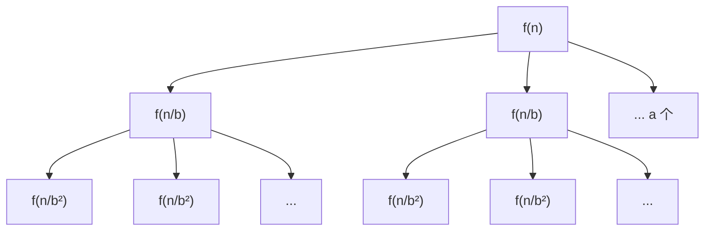

# Chapter 1: 基础与分治

> 对应课程 L01-L03：算法基础、渐近分析、归并排序、快速排序与随机化

## 1.1 什么是算法

（待编写）

## 1.2 渐近分析与渐近记号

（待编写）

## 1.3 分治思想

（待编写）

## 1.4 归并排序与递推关系

（待编写）

## 1.5 主定理（Master Theorem）

主定理是分析分治算法时间复杂度的核心工具。它为形如

$$T(n) = a \cdot T\!\left(\frac{n}{b}\right) + f(n)$$

的递推关系提供了一个"查表式"的解法，其中 $a \geq 1$，$b > 1$，$f(n)$ 是渐近正函数。

### 1.5.1 直觉：递归树的视角

在深入定理之前，我们先建立直觉。考虑递推 $T(n) = a \cdot T(n/b) + f(n)$，它描述的是：

- 将规模为 $n$ 的问题**分成 $a$ 个**规模为 $n/b$ 的子问题
- 分解与合并的代价为 $f(n)$

我们可以把递归过程画成一棵**递归树**：



这棵树有以下关键参数：

| 参数 | 值 |
|------|-----|
| 树的深度 | $\log_b n$ |
| 第 $k$ 层的节点数 | $a^k$ |
| 第 $k$ 层每个节点的代价 | $f(n/b^k)$ |
| 第 $k$ 层的总代价 | $a^k \cdot f(n/b^k)$ |
| 叶子节点总数 | $a^{\log_b n} = n^{\log_b a}$ |

最后一个等式是关键：$a^{\log_b n} = n^{\log_b a}$（取对数即可验证）。

因此，总代价为：

$$T(n) = \sum_{k=0}^{\log_b n} a^k \cdot f\!\left(\frac{n}{b^k}\right)$$

主定理的本质就是比较**叶子层的代价** $\Theta(n^{\log_b a})$ 与**根层的代价** $f(n)$ 谁占主导。

### 1.5.2 定理陈述

**主定理（Master Theorem）**：设 $a \geq 1$，$b > 1$ 为常数，$f(n)$ 为渐近正函数，$T(n)$ 满足递推

$$T(n) = a \cdot T\!\left(\frac{n}{b}\right) + f(n)$$

令 $c^* = \log_b a$，则：

**Case 1（叶子主导）**：若 $f(n) = O(n^{c^* - \varepsilon})$ 对某个常数 $\varepsilon > 0$ 成立，则

$$T(n) = \Theta(n^{c^*})$$

**Case 2（均匀分布）**：若 $f(n) = \Theta(n^{c^*} \log^k n)$ 对某个常数 $k \geq 0$ 成立，则

$$T(n) = \Theta(n^{c^*} \log^{k+1} n)$$

**Case 3（根主导）**：若 $f(n) = \Omega(n^{c^* + \varepsilon})$ 对某个常数 $\varepsilon > 0$ 成立，且满足**正则条件** $a \cdot f(n/b) \leq c \cdot f(n)$ 对某个常数 $c < 1$ 和充分大的 $n$ 成立，则

$$T(n) = \Theta(f(n))$$

> **一句话记忆**：比较 $f(n)$ 和 $n^{\log_b a}$ 的增长速度——谁大谁赢，一样大就多乘一个 $\log$。

### 1.5.3 证明

我们对三种情况分别证明。核心思路是分析递归树各层代价之和。

**总代价公式**：

$$T(n) = \Theta(n^{c^*}) + \sum_{k=0}^{\log_b n - 1} a^k \cdot f\!\left(\frac{n}{b^k}\right)$$

其中 $\Theta(n^{c^*})$ 是叶子层的贡献（共 $n^{c^*}$ 个叶子，每个代价 $\Theta(1)$）。

**Case 1 的证明**：$f(n) = O(n^{c^* - \varepsilon})$

第 $k$ 层的代价为：

$$a^k \cdot f\!\left(\frac{n}{b^k}\right) = a^k \cdot O\!\left(\left(\frac{n}{b^k}\right)^{c^* - \varepsilon}\right) = O\!\left(n^{c^* - \varepsilon} \cdot \left(\frac{a}{b^{c^* - \varepsilon}}\right)^k\right)$$

由于 $c^* = \log_b a$，即 $a = b^{c^*}$，所以：

$$\frac{a}{b^{c^* - \varepsilon}} = \frac{b^{c^*}}{b^{c^* - \varepsilon}} = b^{\varepsilon} > 1$$

因此各层代价构成一个**公比大于 1 的几何级数**，由最后一项（叶子层）主导：

$$\sum_{k=0}^{\log_b n - 1} a^k \cdot f\!\left(\frac{n}{b^k}\right) = O(n^{c^*})$$

加上叶子层本身的 $\Theta(n^{c^*})$，得 $T(n) = \Theta(n^{c^*})$。$\blacksquare$

**Case 2 的证明**：$f(n) = \Theta(n^{c^*} \log^k n)$（以 $k = 0$ 为例）

第 $k$ 层的代价为：

$$a^k \cdot f\!\left(\frac{n}{b^k}\right) = a^k \cdot \Theta\!\left(\left(\frac{n}{b^k}\right)^{c^*}\right) = \Theta\!\left(a^k \cdot \frac{n^{c^*}}{b^{k \cdot c^*}}\right) = \Theta(n^{c^*})$$

因为 $a = b^{c^*}$，所以 $a^k / b^{k \cdot c^*} = 1$。每一层的代价都是 $\Theta(n^{c^*})$，共 $\log_b n + 1$ 层，因此：

$$T(n) = \Theta(n^{c^*}) \cdot (\log_b n + 1) = \Theta(n^{c^*} \log n)$$

更一般地，当 $f(n) = \Theta(n^{c^*} \log^k n)$ 时，类似分析可得 $T(n) = \Theta(n^{c^*} \log^{k+1} n)$。$\blacksquare$

**Case 3 的证明**：$f(n) = \Omega(n^{c^* + \varepsilon})$ 且满足正则条件

正则条件 $a \cdot f(n/b) \leq c \cdot f(n)$（$c < 1$）意味着：

$$a^k \cdot f\!\left(\frac{n}{b^k}\right) \leq c^k \cdot f(n)$$

（对正则条件迭代 $k$ 次即得。）因此：

$$\sum_{k=0}^{\log_b n - 1} a^k \cdot f\!\left(\frac{n}{b^k}\right) \leq f(n) \cdot \sum_{k=0}^{\infty} c^k = \frac{f(n)}{1 - c} = O(f(n))$$

又因为 $T(n) \geq f(n)$（根层本身的代价），所以 $T(n) = \Theta(f(n))$。$\blacksquare$

### 1.5.4 应用案例

#### 案例 1：归并排序

```python
def merge_sort(arr):
    if len(arr) <= 1:
        return arr
    mid = len(arr) // 2
    left = merge_sort(arr[:mid])      # T(n/2)
    right = merge_sort(arr[mid:])     # T(n/2)
    return merge(left, right)          # O(n)
```

递推关系：$T(n) = 2T(n/2) + O(n)$

- $a = 2$，$b = 2$，$f(n) = O(n)$
- $c^* = \log_2 2 = 1$
- $f(n) = \Theta(n^1) = \Theta(n^{c^*})$

属于 **Case 2**（$k = 0$），因此 $T(n) = \Theta(n \log n)$。

#### 案例 2：二分搜索

```python
def binary_search(arr, target, lo, hi):
    if lo > hi:
        return -1
    mid = (lo + hi) // 2
    if arr[mid] == target:
        return mid
    elif arr[mid] < target:
        return binary_search(arr, target, mid + 1, hi)   # T(n/2)
    else:
        return binary_search(arr, target, lo, mid - 1)    # T(n/2)
    # 只递归一个分支！合并代价 O(1)
```

递推关系：$T(n) = T(n/2) + O(1)$

- $a = 1$，$b = 2$，$f(n) = O(1)$
- $c^* = \log_2 1 = 0$
- $f(n) = \Theta(1) = \Theta(n^0) = \Theta(n^{c^*})$

属于 **Case 2**（$k = 0$），因此 $T(n) = \Theta(\log n)$。

#### 案例 3：Karatsuba 大整数乘法

将两个 $n$ 位整数各拆成高低两半，通过巧妙的代数变换，只需 3 次（而非 4 次）$n/2$ 位乘法：

递推关系：$T(n) = 3T(n/2) + O(n)$

- $a = 3$，$b = 2$，$f(n) = O(n)$
- $c^* = \log_2 3 \approx 1.585$
- $f(n) = O(n) = O(n^{1.585 - 0.585})$，取 $\varepsilon = 0.585$

属于 **Case 1**（叶子主导），因此 $T(n) = \Theta(n^{\log_2 3}) \approx \Theta(n^{1.585})$。

这比朴素的 $O(n^2)$ 乘法快得多！

#### 案例 4：Strassen 矩阵乘法

将 $n \times n$ 矩阵分成 4 个 $n/2 \times n/2$ 的子矩阵，通过 7 次（而非 8 次）子矩阵乘法完成：

递推关系：$T(n) = 7T(n/2) + O(n^2)$

- $a = 7$，$b = 2$，$f(n) = O(n^2)$
- $c^* = \log_2 7 \approx 2.807$
- $f(n) = O(n^2) = O(n^{2.807 - 0.807})$，取 $\varepsilon = 0.807$

属于 **Case 1**，因此 $T(n) = \Theta(n^{\log_2 7}) \approx \Theta(n^{2.807})$。

#### 案例 5：一个 Case 3 的例子

递推关系：$T(n) = 2T(n/2) + O(n^2)$

- $a = 2$，$b = 2$，$f(n) = O(n^2)$
- $c^* = \log_2 2 = 1$
- $f(n) = \Omega(n^{1 + 1})$，取 $\varepsilon = 1$
- 正则条件：$2 \cdot (n/2)^2 = n^2/2 \leq c \cdot n^2$，取 $c = 1/2 < 1$ ✓

属于 **Case 3**（根主导），因此 $T(n) = \Theta(n^2)$。

直觉：每层的合并代价 $n^2$ 远大于子问题的增长速度，总代价被根层主导。

### 1.5.5 案例汇总

| 递推关系 | $a$ | $b$ | $f(n)$ | $c^* = \log_b a$ | Case | $T(n)$ |
|---------|-----|-----|--------|-------------------|------|--------|
| $T(n) = 2T(n/2) + n$ | 2 | 2 | $n$ | 1 | 2 | $\Theta(n \log n)$ |
| $T(n) = T(n/2) + 1$ | 1 | 2 | $1$ | 0 | 2 | $\Theta(\log n)$ |
| $T(n) = 3T(n/2) + n$ | 3 | 2 | $n$ | 1.585 | 1 | $\Theta(n^{1.585})$ |
| $T(n) = 7T(n/2) + n^2$ | 7 | 2 | $n^2$ | 2.807 | 1 | $\Theta(n^{2.807})$ |
| $T(n) = 2T(n/2) + n^2$ | 2 | 2 | $n^2$ | 1 | 3 | $\Theta(n^2)$ |
| $T(n) = 4T(n/2) + n^2$ | 4 | 2 | $n^2$ | 2 | 2 | $\Theta(n^2 \log n)$ |
| $T(n) = 9T(n/3) + n$ | 9 | 3 | $n$ | 2 | 1 | $\Theta(n^2)$ |
| $T(n) = T(2n/3) + 1$ | 1 | 3/2 | $1$ | 0 | 2 | $\Theta(\log n)$ |

### 1.5.6 主定理的局限性

主定理并非万能。以下情况**不能直接使用**主定理：

1. **子问题大小不等**：如 $T(n) = T(n/3) + T(2n/3) + n$（归并排序的不均匀划分）。此时需要用 Akra-Bazzi 定理或直接分析递归树。

2. **$f(n)$ 落在"间隙"中**：如 $T(n) = 2T(n/2) + n / \log n$。这里 $f(n) = n / \log n$ 比 $n^{c^*} = n$ 小，但不是多项式地小（没有 $\varepsilon > 0$ 使得 $n / \log n = O(n^{1-\varepsilon})$），所以 Case 1 不适用。

3. **非常数的 $a$ 或 $b$**：如 $T(n) = \sqrt{n} \cdot T(\sqrt{n}) + n$。

遇到这些情况时，回到递归树分析或换元法是更可靠的策略。

## 1.6 快速排序与随机化

（待编写）

## 1.7 期望时间分析

（待编写）

## 1.8 选择问题

（待编写）

## 1.9 练习题

（待编写）
