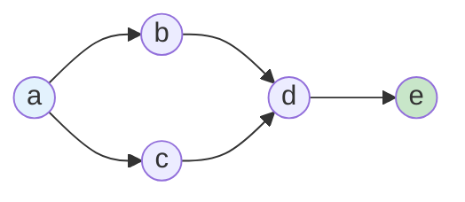
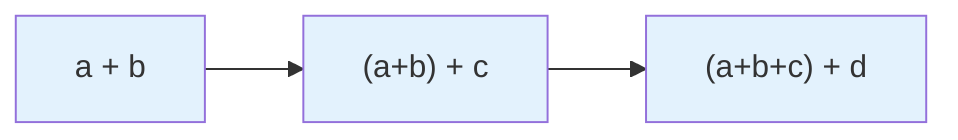
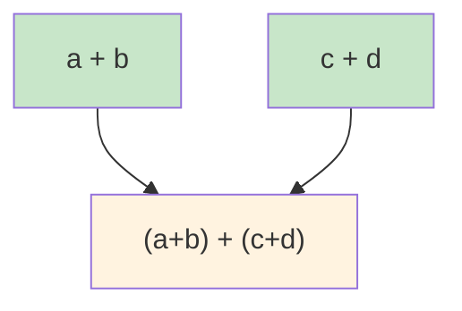
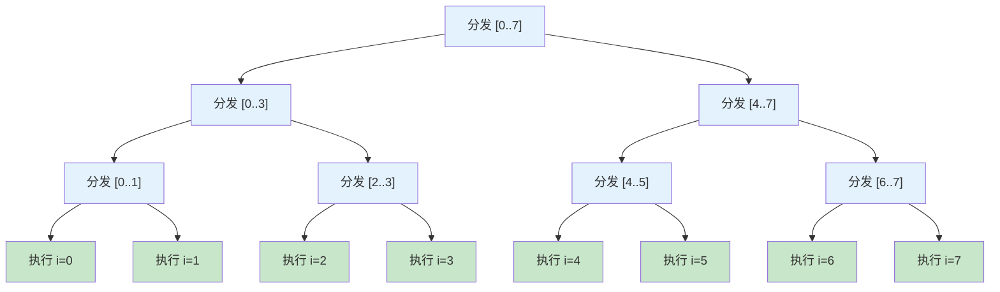
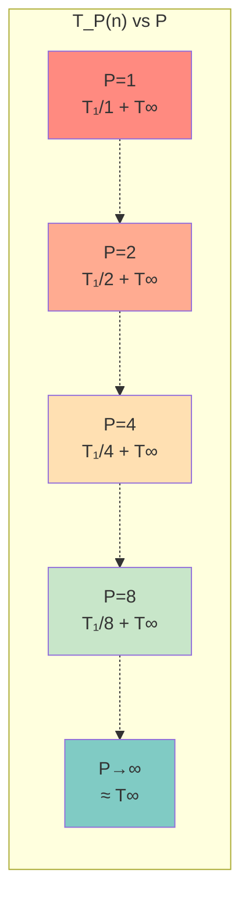
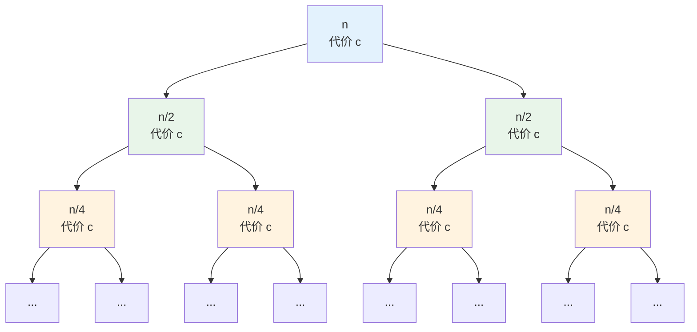
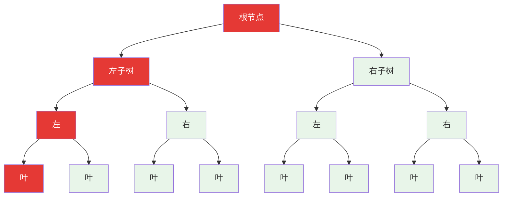
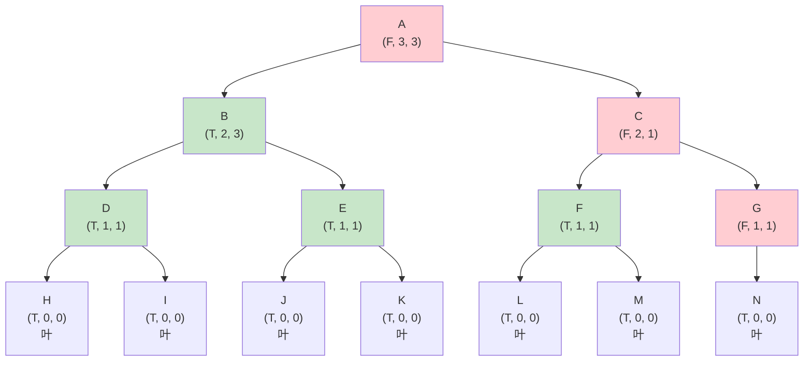

# Chapter 2: 并行算法

> 对应课程 L04-L05：并行计算概念、Work/Span 分析与并行算法设计

---

期中考难度预测Easy: 判定 Race condition，计算简单分治的 Work/Span (如 Parallel Sum)。Medium: 树形算法 (Tree traversal)，矩阵向量乘法 (Matrix-Vector Mult)。Hard: 需要嵌套并行的问题 (类似 Majority Element 或 Merge Sort)，要求推导出 $O(\log^2 n)$ 的 Span。

## 2.1 性能分析指标与 Fork-Join 编程原语

### 2.1.1 从串行到并行：为什么需要新的分析框架

在串行算法中，我们用一个函数 $T(n)$ 描述运行时间就够了——因为只有一个处理器，所有操作按顺序执行。但在并行计算中，多个处理器可以**同时**执行不同的操作，这带来了两个新问题：

1. **总工作量是多少？** 所有处理器加起来一共做了多少操作？
2. **最快能多快？** 即使有无限多处理器，最短需要多长时间？

为了回答这两个问题，我们需要一种能够表达"哪些操作可以并行、哪些必须串行"的数学模型——这就是**计算 DAG**。

### 2.1.2 有向无环图（DAG）

**有向无环图**（Directed Acyclic Graph，简称 DAG）是一种特殊的有向图，其中不存在从任何节点出发经过若干条有向边又回到自身的路径（即无环）。

**形式化定义**：一个 DAG 是一个有向图 $G = (V, E)$，其中 $V$ 是节点集合，$E \subseteq V \times V$ 是有向边集合，且 $G$ 中不存在有向环。



> **图示说明**：一个简单的 DAG。节点 a 是源点（无入边），节点 e 是汇点（无出边）。边 $a \to b$ 和 $a \to c$ 表示 b、c 可以在 a 完成后**并行**执行；边 $b \to d$ 和 $c \to d$ 表示 d 必须等待 b 和 c **都完成**后才能开始。

DAG 的两个关键性质：

- **拓扑排序**：DAG 的节点总可以排成一个线性序列，使得所有边都从前指向后。这保证了"先做什么、后做什么"的偏序关系是良定义的。
- **最长路径**：DAG 中从源点到汇点的最长路径长度，决定了完成所有任务所需的最短时间（即使有无限资源）。

### 2.1.3 计算 DAG（Computation DAG）

在并行算法分析中，我们将算法的执行过程建模为一个 DAG，称为**计算 DAG**：

- **节点**：每个节点代表一个**常数时间的操作**（如一次加法、一次比较）
- **有向边**：边 $u \to v$ 表示操作 $v$ 依赖于操作 $u$ 的结果，即 $u$ 必须在 $v$ 之前完成

以"计算 $a + b + c + d$"为例，串行和并行的计算 DAG 分别为：

**串行计算 DAG**（链状）：



**并行计算 DAG**（树状）：



> 串行 DAG 有 3 个节点且最长路径为 3；并行 DAG 同样有 3 个节点，但最长路径仅为 2。节点总数（总工作量）相同，但最长路径（关键路径）不同——这正是 Work 和 Span 的区别。

### 2.1.4 Work 与 Span

有了计算 DAG 的概念，我们可以定义并行算法的两个核心性能指标。

**Work**（总工作量，$T_1$）是指在**单处理器**（串行）模式下执行该算法所需的总操作数。

- 它代表了计算消耗的总能量。
- **公式**：

$$
T_1(n) = \text{计算 DAG 中所有节点的总数}
$$

**Span**（关键路径长度，$T_\infty$）是指在**无限处理器**模式下，算法运行的最短可能时间。

- 它对应于计算 DAG 中，从起始节点到终止节点的**最长路径**（按执行时间加权）。
- **意义**：Span 决定了并行算法的理论极限速度。无论增加多少处理器，运行时间永远无法低于 $T_\infty(n)$。

### 2.1.5 核心记号汇总

| 记号 | 名称 | 含义 |
|------|------|------|
| $P$ | 处理器数 | 可用的并行处理器数量 |
| $T_1(n)$ | **Work**（总工作量） | 用 **1 个**处理器（串行）执行算法的总操作数 |
| $T_\infty(n)$ | **Span**（关键路径） | 用**无限个**处理器执行算法的最短时间，即计算 DAG 的最长路径 |
| $T_P(n)$ | $P$-处理器时间 | 用 $P$ 个处理器执行算法的实际运行时间 |
| $T_1 / T_\infty$ | **并行度** | 算法能有效利用的最大处理器数量 |

**直觉**：
- $T_1$ 回答"一共要做多少事"——对应计算 DAG 中**所有节点**的总数
- $T_\infty$ 回答"最快能多快"——对应计算 DAG 中**最长路径**的长度
- 并行度 $T_1 / T_\infty$ 回答"值得用多少个处理器"——超过这个数再加处理器也没用

### 2.1.6 Fork-Join 并行模型

本章采用 **fork-join**（分叉-汇合）并行模型，使用以下关键原语：

| 原语 | 含义 |
|------|------|
| `spawn f(x)` | **分叉**：创建一个新的并行任务来执行 `f(x)`，主线程继续向下执行而不等待 |
| `sync` | **汇合**：主线程在此处等待，直到之前所有 `spawn` 出去的任务都完成 |
| `parallel for` | **并行循环**：将循环的各次迭代分配给不同处理器并行执行。其 Span 为 $O(\log n)$（递归分发迭代的树高） |

**示例**：并行计算两个子问题

```python
def solve(problem):
    if base_case(problem):
        return trivial_answer

    spawn result_left  = solve(left_half)   # 分叉：新线程处理左半部分
    result_right = solve(right_half)         # 主线程继续处理右半部分
    sync                                     # 等待左半部分完成
    return combine(result_left, result_right)
```

在计算 DAG 中，`spawn` 产生一个分叉点（一个节点有两条出边），`sync` 产生一个汇合点（一个节点有两条入边）。

#### `parallel for` 的 Span 为什么是 $O(\log n)$？

`parallel for i in range(n)` **并非**简单地同时启动 $n$ 个任务。如果真的串行地逐个 `spawn` 出 $n$ 个任务，光是"发任务"这个过程本身就需要 $O(n)$ 的 Span——这就失去了并行的意义。

实际上，`parallel for` 通过**递归二分**来分发任务。以 `parallel for i in range(8)` 为例，其内部实现等价于：

```python
def parallel_for(A, lo, hi, body):
    if lo == hi:
        body(A, lo)              # 基本情况：执行单次迭代
        return
    mid = (lo + hi) // 2
    spawn parallel_for(A, lo, mid, body)    # 左半部分
    parallel_for(A, mid + 1, hi, body)      # 右半部分
    sync
```

这构成了一棵**二叉分发树**：



> **图示说明**：蓝色节点是分发操作（每个 $O(1)$），绿色节点是实际的循环体执行。树高为 $\log_2 8 = 3$，因此分发过程的 Span 为 $O(\log n)$。所有绿色节点在无限处理器下**同时**执行。

**总结**：`parallel for` 对 $n$ 次迭代的 Span 公式为：

$$
T_\infty(\texttt{parallel for}) = O(\log n) + \max_{i}(\text{第 } i \text{ 次迭代的 Span})
$$

- 第一项 $O(\log n)$：递归二分分发树的高度
- 第二项：所有迭代中最慢那个的 Span（因为它们并行执行，取 max）

**特别地**：如果每次迭代的 Span 为 $O(1)$（如简单赋值 `C[i] = A[i] + B[i]`），则整个 `parallel for` 的 Span 为 $O(\log n)$。

---

## 2.2 有界并行性（Bounded Parallelism）

在实际中，处理器数量 $P$ 是有限的。本节分析在 $P$ 个处理器下的运行时间 $T_P(n)$。

### 2.2.1 并行性定律（Brent 定理变体）

$T_P(n)$ 受限于两个下界：

1. **处理器分担总工作量**：$T_P(n) \ge \dfrac{T_1(n)}{P}$
2. **关键路径限制**：$T_P(n) \ge T_\infty(n)$

综合起来的近似公式（Greedy Scheduler）：

$$
T_P(n) \approx \frac{T_1(n)}{P} + T_\infty(n)
$$

### 2.2.2 $T_P(n)$ 随处理器数的变化



> **图示说明**：随着处理器数 $P$ 增加，$T_P(n)$ 迅速下降（线性加速阶段），随后趋于平缓，最终无限逼近渐近线 $y = T_\infty(n)$。这证明了 Span 是不可逾越的物理极限。

### 2.2.3 线性加速与并行度

当 $P \le T_1 / T_\infty$ 时，$T_1/P$ 项主导，算法获得近似**线性加速**（处理器翻倍，时间减半）。

当 $P > T_1 / T_\infty$ 时，$T_\infty$ 项主导，增加处理器几乎无法进一步加速。

因此，**并行度** $T_1 / T_\infty$ 是衡量算法并行化潜力的关键指标：
- 并行度高（如 $n / \log n$）→ 可以有效利用大量处理器
- 并行度低（如 $O(1)$）→ 算法本质上是串行的，无法并行加速

---

## 2.3 竞态条件（Race Condition）

**场景**：两个处理器 $P_1, P_2$ 并行执行 `x = x + 1`，初始状态 $x = 0$。

**目标**：严格证明为何结果可能是 1 而非 2。

### 2.3.1 原子操作分解

高级语言中的 `x = x + 1` 并非原子操作。在机器指令层级，它被分解为三个独立步骤：

1. **LOAD**：从内存读取值到本地寄存器（$R_i \leftarrow x$）
2. **ADD**：在本地寄存器中自增（$R_i \leftarrow R_i + 1$）
3. **STORE**：将寄存器值写回内存（$x \leftarrow R_i$）

### 2.3.2 交错执行证明

假设调度器按以下时间线调度指令：

| 时间步 | 处理器 $P_1$ | 处理器 $P_2$ | 内存值 $x$ |
|--------|-------------|-------------|-----------|
| $t_0$ | LOAD $R_1 \leftarrow x$（读到 0） | 空闲 | 0 |
| $t_1$ | 空闲 | LOAD $R_2 \leftarrow x$（读到 0） | 0 |
| $t_2$ | ADD $R_1 \leftarrow R_1 + 1$（$R_1 = 1$） | 空闲 | 0 |
| $t_3$ | 空闲 | ADD $R_2 \leftarrow R_2 + 1$（$R_2 = 1$） | 0 |
| $t_4$ | STORE $x \leftarrow R_1$（写入 1） | 空闲 | **1** |
| $t_5$ | 空闲 | STORE $x \leftarrow R_2$（写入 1） | **1** |

**结论**：即使执行了两次加法，最终内存中的 $x$ 依然是 1。这就是**竞态条件**（Race Condition）。在并行算法设计中，必须使用 `sync` 同步原语或原子操作来避免这种情况。

<!-- CH02_PART3_PLACEHOLDER -->

---

## 2.4 算法 I：并行求和（Parallel Sum）

**问题**：计算 $S = \sum_{i=1}^n A[i]$，使用分治策略并行化。

**代码结构**：

```python
def PSUM(A, L, R):
    if L == R:
        return A[L]
    Mid = (L + R) // 2
    spawn S1 = PSUM(A, L, Mid)     # 并行分支
    S2 = PSUM(A, Mid + 1, R)       # 主线程继续
    sync                            # 等待 S1 完成
    return S1 + S2                  # 合并步骤
```

补充： BPSUM

核心逻辑: 增加了 Base Case 的阈值判断，防止产生过多线程。

BPSUM(A, l, r)
    // 阈值判断：如果任务量小于平均分配量，直接转串行
    if (r - l + 1) <= ceil(n / P):
        return SerialSum(A, l, r) 
        
    m = floor((l + r) / 2)
    spawn s1 = BPSUM(A, l, m)
    s2 = BPSUM(A, m + 1, r)
    sync
    return s1 + s2

### 2.4.1 Work 分析（$T_1$）

当 $P = 1$ 时，`spawn` 和 `sync` 退化为普通函数调用。

**递推关系**：

$$
T_1(n) = 2T_1(n/2) + O(1)
$$

- $2T_1(n/2)$：两个子问题的递归调用
- $O(1)$：计算 Mid 和最后的加法运算

**递归树证明**：



逐层求和：

- Level 0：1 个节点，代价 $c$
- Level 1：2 个节点，代价 $2c$
- Level $i$：$2^i$ 个节点，代价 $2^i \cdot c$
- Level $\log_2 n$：$n$ 个叶子节点，代价 $n \cdot c$

$$
T_1(n) = \sum_{i=0}^{\log_2 n} 2^i \cdot c = c \cdot \frac{2^{\log_2 n + 1} - 1}{2 - 1} = c(2n - 1) = O(n)
$$

> 也可直接用主定理：$a = 2, b = 2, d = 0$，$\log_b a = 1 > 0 = d$ → Case 3，$T_1(n) = O(n)$。

<!-- CH02_PART4_PLACEHOLDER -->

### 2.4.2 Span 分析（$T_\infty$）

在无限处理器下，`S1` 和 `S2` **同时**开始运行。关键路径取决于两者中较慢的一个（取 max），加上当前层级的开销。

**递推关系**：

$$
T_\infty(n) = \max\!\big(T_\infty(n/2),\; T_\infty(n/2)\big) + O(1) = T_\infty(n/2) + O(1)
$$

**逐步展开证明**：

1. $T_\infty(n) = T_\infty(n/2) + c$
2. 代入 $T_\infty(n/2)$：$T_\infty(n) = [T_\infty(n/4) + c] + c = T_\infty(n/4) + 2c$
3. 代入 $T_\infty(n/4)$：$T_\infty(n) = [T_\infty(n/8) + c] + 2c = T_\infty(n/8) + 3c$
4. 第 $k$ 步的一般形式：$T_\infty(n) = T_\infty(n/2^k) + k \cdot c$
5. 当 $n/2^k = 1$，即 $k = \log_2 n$ 时到达基本情况：

$$
T_\infty(n) = T_\infty(1) + c \cdot \log_2 n = O(1) + c\log n = O(\log n)
$$

**递归树中的 Work 与 Span 对比**：



> **图示说明**：红色路径为 **Span**（从根到最左叶的关键路径，长度 = 树高 $O(\log n)$）。所有节点的总和为 **Work**（$O(n)$）。

---

## 2.5 算法 II：并行矩阵乘法

**问题**：计算 $C = A \times B$，其中 $A, B$ 为 $n \times n$ 矩阵。

**方法**：分块矩阵分治。将矩阵分为 4 个 $n/2 \times n/2$ 的子矩阵：

$$
C_{11} = A_{11}B_{11} + A_{12}B_{21}, \quad C_{12} = A_{11}B_{12} + A_{12}B_{22}
$$

$$
C_{21} = A_{21}B_{11} + A_{22}B_{21}, \quad C_{22} = A_{21}B_{12} + A_{22}B_{22}
$$

共需 8 次子矩阵乘法和 4 次子矩阵加法。

**伪代码**：

```python
def PMATMUL(A, B, n):
    """并行分治矩阵乘法：计算 C = A × B，A, B 为 n×n 矩阵"""
    if n == 1:
        return A[0][0] * B[0][0]

    # 将 A, B 分为 4 个 n/2 × n/2 子矩阵
    A11, A12, A21, A22 = split(A)
    B11, B12, B21, B22 = split(B)

    # 8 次子矩阵乘法，全部并行执行
    spawn D1 = PMATMUL(A11, B11, n/2)
    spawn D2 = PMATMUL(A12, B21, n/2)
    spawn D3 = PMATMUL(A11, B12, n/2)
    spawn D4 = PMATMUL(A12, B22, n/2)
    spawn D5 = PMATMUL(A21, B11, n/2)
    spawn D6 = PMATMUL(A22, B21, n/2)
    spawn D7 = PMATMUL(A21, B12, n/2)
    D8 = PMATMUL(A22, B22, n/2)
    sync  # 等待所有 spawn 完成

    # 4 次子矩阵加法，用 parallel for 并行执行
    parallel for i, j in range(n/2) × range(n/2):
        C11[i][j] = D1[i][j] + D2[i][j]
        C12[i][j] = D3[i][j] + D4[i][j]
        C21[i][j] = D5[i][j] + D6[i][j]
        C22[i][j] = D7[i][j] + D8[i][j]

    return combine(C11, C12, C21, C22)
```

> **代码要点**：
> - 8 次递归乘法通过 `spawn` 并行执行（7 个 spawn + 1 个主线程直接执行）
> - 矩阵加法通过 `parallel for` 对所有 $(n/2)^2$ 个元素并行执行
> - `sync` 确保所有递归乘法完成后才开始加法

### 2.5.1 Work 分析（$T_1$）

这与串行分治矩阵乘法完全一致：

$$
T_1(n) = 8T_1(n/2) + O(n^2)
$$

- $8T_1(n/2)$：8 次递归子矩阵乘法
- $O(n^2)$：矩阵加法在串行下需要 $n^2$ 次操作

由主定理（$a = 8, b = 2, d = 2$）：$\log_b a = \log_2 8 = 3 > 2 = d$ → Case 3：

$$
T_1(n) = O(n^{\log_2 8}) = O(n^3)
$$

### 2.5.2 Span 分析（$T_\infty$）— 易错点

这是考试中最容易出错的地方。

**递推结构分析**（对照上面的伪代码逐步分析）：

**第一步：8 次递归乘法的 Span**

8 次 `PMATMUL` 调用通过 `spawn` 并发执行。在无限处理器下，它们同时运行，Span 取最慢的那个（即 $\max$）。由于 8 次调用的规模都是 $n/2$，所以：

$$
T_\infty^{\text{乘法}} = \max(T_\infty(n/2), \ldots, T_\infty(n/2)) = T_\infty(n/2)
$$

**第二步：矩阵加法的 Span — 为什么不是 $O(1)$？**

加法步骤用 `parallel for` 对 $(n/2)^2$ 个元素并行执行 `C[i][j] = D[i][j] + E[i][j]`。

**常见错误**：认为"每个加法 $O(1)$，全部并行，所以 Span = $O(1)$"。

**正确分析**：回顾 2.1.6 节的结论，`parallel for` 通过递归二分来分发任务。对 $(n/2)^2$ 个元素的 `parallel for`，其分发树高度为：

$$
\log_2\!\left(\frac{n}{2}\right)^2 = 2\log_2\!\frac{n}{2} = 2(\log_2 n - 1) = O(\log n)
$$

每次迭代的循环体是简单赋值（$O(1)$ Span），因此：

$$
T_\infty^{\text{加法}} = O(\log n) + O(1) = O(\log n)
$$

**第三步：合并**

乘法和加法是串行的（先乘后加），所以总 Span 相加：

$$
T_\infty(n) = T_\infty^{\text{乘法}} + T_\infty^{\text{加法}} = T_\infty(n/2) + O(\log n)
$$

**正确的递推关系**：

$$
T_\infty(n) = T_\infty(n/2) + O(\log n)
$$

**求解过程（逐层求和）**：

第 $i$ 层的问题规模为 $n/2^i$，该层的本地代价为 $O(\log(n/2^i))$：

$$
T_\infty(n) = \sum_{i=0}^{\log_2 n} c \cdot \log\!\left(\frac{n}{2^i}\right)
$$

利用对数性质 $\log(A/B) = \log A - \log B$：

$$
T_\infty(n) = c \sum_{i=0}^{\log n} (\log n - i)
$$

令 $L = \log n$，则：

$$
T_\infty(n) = c \sum_{j=0}^{L} j = c \cdot \frac{L(L+1)}{2} = O(\log^2 n)
$$

**最终结果**：

$$
T_\infty(n) = O(\log^2 n)
$$

<!-- CH02_PART6_PLACEHOLDER -->

---

## 2.6 算法 III：并行归并排序

补充：假并行

核心逻辑: 递归是并行的，但 Merge 是串行的。

Span: $O(n)$ (瓶颈在 Merge)

MergeSort(S, l, r)
    if l < r:
        m = floor((l + r) / 2)
        spawn MergeSort(S, l, m)
        MergeSort(S, m + 1, r)
        sync
        
        // 瓶颈在这里：串行合并
        Merge(S, l, m, r)

True Parallel Merge Sort (真并行)

核心逻辑: 使用 Binary Search 进行并行合并。

Span: $O(\log^2 n)$


PMergeSort(S, n)
    if n == 1 return S
    m = n / 2
    spawn L = PMergeSort(S[1..m])
    R = PMergeSort(S[m+1..n])
    sync
    
    // 调用并行合并
    return PMerge(L, R)

PMerge(A, B) // 合并两个有序数组 A 和 B
    n = length(A)
    m = length(B)
    C = new array of size n + m
    
    // 对 A 中每个元素，去 B 里找位置 (Rank)
    parallel for i = 1 to n:
        rank = BinarySearch(B, A[i]) 
        C[i + rank] = A[i]
        
    // 对 B 中每个元素，去 A 里找位置 (Rank)
    parallel for j = 1 to m:
        rank = BinarySearch(A, B[j])
        C[j + rank] = B[j]
        
    return C


**核心逻辑**：$T(n) = T(\text{sort\_left}) + T(\text{sort\_right}) + T(\text{merge})$。

排序部分为 $T(n/2)$，因此瓶颈在于 $T(\text{merge})$。

### 2.6.1 串行合并的失败

若使用标准的"双指针"合并：

- 合并 Work：$O(n)$
- 合并 Span：$O(n)$（无法跳跃前进）
- 排序 Span 递推：

$$
T_\infty(n) = T_\infty(n/2) + n
$$

$$
T_\infty(n) = n + n/2 + n/4 + \cdots = O(n)
$$

- **结论**：$O(n)$ 的 Span 意味着排序几乎无法获得并行加速，这是不可接受的。

### 2.6.2 并行合并（基于 Rank）

**思路**：对数组 A 中的每个元素 $x$，独立地计算它在结果数组 C 中的最终位置。

**机制**：

1. 找到 $x$ 在 A 中的位置（已知，索引 $i$）
2. 用**二分搜索**找到 $x$ 在 B 中的排名（$O(\log n)$）
3. 最终排名 = $i + \text{Rank}_B(x)$

**合并步骤的 Span**：

对所有 $n$ 个元素执行 `Parallel For`，每个元素执行一次二分搜索：

$$
T_\infty^{\text{merge}}(n) = \max_i\!\big(\text{BinarySearch Time}\big) = O(\log n)
$$

### 2.6.3 并行归并排序的完整分析

将改进后的合并 Span 代入排序递推：

$$
T_\infty(n) = T_\infty(n/2) + T_\infty^{\text{merge}}(n) = T_\infty(n/2) + O(\log n)
$$

这与 2.5.2 节矩阵乘法的 Span 推导在数学上完全相同：

$$
T_\infty(n) = \sum_{i=0}^{\log n} \log\!\left(\frac{n}{2^i}\right) = O(\log^2 n)
$$

**最终结果**：

| 指标 | 复杂度 | 说明 |
|------|--------|------|
| Work | $O(n \log n)$ | 最优（与串行归并排序相同） |
| Span | $O(\log^2 n)$ | 高度并行化 |

<!-- CH02_PART7_PLACEHOLDER -->

---

## 2.7 备考练习：Recitation 题目

### 2.7.1 并行多数元素（Parallel Majority Element）

**问题**：判断数组中是否存在出现次数 $> n/2$ 的元素。目标：$O(n \log n)$ Work，$O(\log^2 n)$ Span。

**并行分治算法**：

1. **Divide**：将数组分为左右两半
2. **Recurse**：并行 `spawn` 分别在左半部分找候选多数元素 $m_L$，右半部分找 $m_R$
3. **Combine**（关键步骤）：
   - 若 $m_L = m_R$，直接返回 $m_L$
   - 否则，在**整个**数组 $A$ 中分别统计 $m_L$ 和 $m_R$ 的出现次数
   - 返回出现次数 $> n/2$ 的那个（若存在）

补充
PFIND_MAJORITY(A, l, r)
    if l == r: return A[l]
    m = floor((l + r) / 2)
    
    // 1. 并行递归找左右候选众数
    spawn a1 = PFIND_MAJORITY(A, l, m)
    a2 = PFIND_MAJORITY(A, m + 1, r)
    sync
    
    // 2. 并行统计 a1 和 a2 在 *当前整个范围* 内的出现次数
    // PCOUNT 是一个类似 Parallel Sum 的并行归约函数
    c1 = PCOUNT(A, l, r, a1) 
    c2 = PCOUNT(A, l, r, a2)
    
    if c1 > (r - l + 1) / 2: return a1
    if c2 > (r - l + 1) / 2: return a2
    return None

分治法查找众数 + 并行计数。Work (总工作量 $T_1$): $O(n \log n)$解释: 递归式 $W(n) = 2W(n/2) + O(n)$（因为 Count 需要 $O(n)$ work）。解得 $O(n \log n)$ 。Span (关键路径 $T_\infty$): $O(\log^2 n)$解释:Count 步骤: 使用并行归约统计次数，Span 是 $O(\log n)$ 。整体递归: $T_\infty(n) = T_\infty(n/2) + O(\log n)$。解: $O(\log^2 n)$ 。    

**"统计"步骤的 Span 分析**：

如何并行统计 $x$ 在 $A$ 中的出现次数？

- 使用并行归约（类似并行求和）
- 将每个元素映射为：若 $A[i] = x$ 则 1，否则 0
- 用并行求和对这些 1 求和
- **Span**：$O(\log n)$

**总 Span 递推**：

$$
T_\infty(n) = T_\infty(n/2) + O(\log n) = O(\log^2 n)
$$

### 2.7.2 并行最大完美子树（Parallel Perfect Subtree）

**问题**：给定一棵二叉树，找到最大完美子树的大小。

**目标**：Span $O(h)$，Work $O(n)$。

**算法设计**：

函数 `CheckPerfect(node)` 返回一个三元组：

1. `is_perfect`：布尔值，该子树是否为完美二叉树
2. `height`：整数，子树高度
3. `max_size`：整数，该子树中最大完美子树的大小

```python
def CheckPerfect(node):
    if node is None:
        return (True, 0, 0)

    spawn (L_perf, L_h, L_max) = CheckPerfect(node.left)
    (R_perf, R_h, R_max) = CheckPerfect(node.right)
    sync

    # 常数时间逻辑 O(1)
    current_perfect = L_perf and R_perf and (L_h == R_h)
    current_height = max(L_h, R_h) + 1

    if current_perfect:
        current_size = 2 ** current_height - 1
        return (True, current_height, current_size)
    else:
        return (False, current_height, max(L_max, R_max))
```

**Span 证明**：

每个节点在 `sync` 之后的逻辑为 $O(1)$：

$$
T_\infty(n) = \max\!\big(T_\infty(\text{Left}),\; T_\infty(\text{Right})\big) + O(1)
$$

这正是树的高度的定义。因此：

$$
T_\infty(n) = O(h)
$$

**示例：非完美二叉树的自底向上计算**：



> **图示说明**：每个节点标注三元组 $(P, h, s)$，其中 P = is_perfect，h = height，s = max_size。绿色节点为完美子树，红色为非完美。节点 B 是最大完美子树（大小 3）。注意节点 G 只有一个子节点 N，因此不完美，导致 C 和 A 也不完美。即使树不平衡，Span 也只与树高 $h$ 有关，而与节点总数 $n$ 无关。

---
