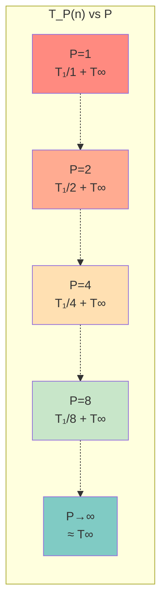
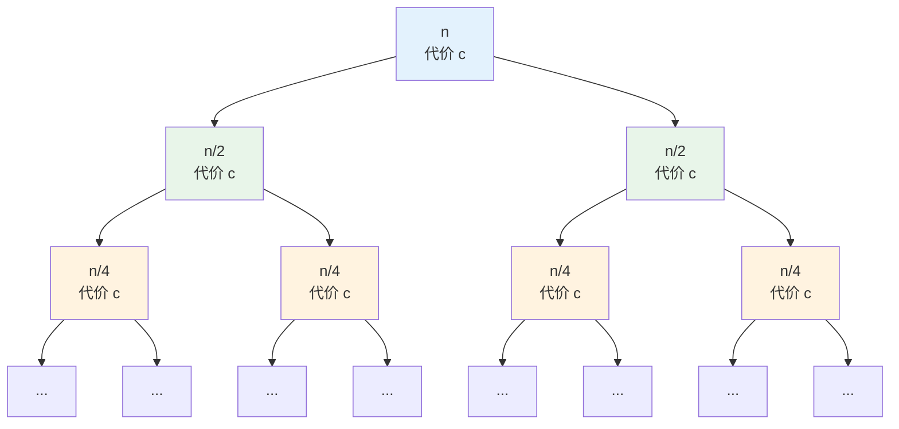
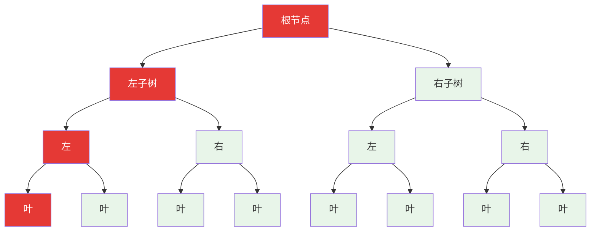
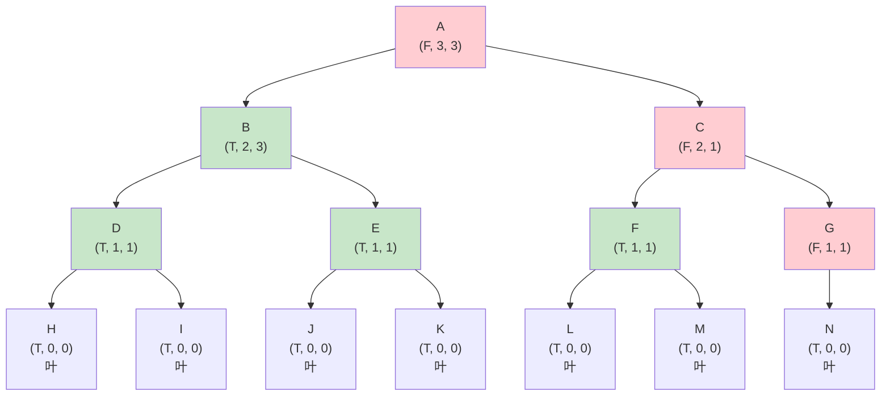

# Chapter 2: 并行算法

> 对应课程 L04-L05：并行计算概念、Work/Span 分析与并行算法设计

---

## 2.1 理论基础：Work 与 Span 分析

在并行算法中，我们不再使用单一的 $T(n)$，而是必须同时计算两个核心指标。

### 2.1.1 Work 的数学定义（$T_1$）

**Work**（总工作量）是指在**单处理器**（串行）模式下执行该算法所需的总操作数。

- 它代表了计算消耗的总能量。
- **公式**：

$$
T_1(n) = \text{计算 DAG 中所有操作的总和}
$$

### 2.1.2 Span 的数学定义（$T_\infty$）

**Span**（关键路径长度）是指在**无限处理器**模式下，算法运行的最短可能时间。

- 它对应于计算 DAG（有向无环图）中，从起始节点到终止节点的**最长路径**（按执行时间加权）。
- **意义**：Span 决定了并行算法的理论极限速度。无论增加多少处理器，运行时间永远无法低于 $T_\infty(n)$。

### 2.1.3 并行性定律（Brent 定理变体）

我们如何计算 $P$ 个处理器下的实际运行时间 $T_P(n)$？

实际运行时间受限于两个下界：

1. **处理器分担总工作量**：$T_P(n) \ge \dfrac{T_1(n)}{P}$
2. **关键路径限制**：$T_P(n) \ge T_\infty(n)$

综合起来的近似公式（Greedy Scheduler）：

$$
T_P(n) \approx \frac{T_1(n)}{P} + T_\infty(n)
$$

<!-- CH02_PART2_PLACEHOLDER -->

**$T_P(n)$ 关于 $P$ 的函数图像**：



> **图示说明**：随着处理器数 $P$ 增加，$T_P(n)$ 迅速下降（线性加速阶段），随后趋于平缓，最终无限逼近渐近线 $y = T_\infty(n)$。这证明了 Span 是不可逾越的物理极限。

---

## 2.2 竞态条件陷阱（Race Condition）

**场景**：两个处理器 $P_1, P_2$ 并行执行 `x = x + 1`，初始状态 $x = 0$。

**目标**：严格证明为何结果可能是 1 而非 2。

### 2.2.1 原子操作分解

高级语言中的 `x = x + 1` 并非原子操作。在机器指令层级，它被分解为三个独立步骤：

1. **LOAD**：从内存读取值到本地寄存器（$R_i \leftarrow x$）
2. **ADD**：在本地寄存器中自增（$R_i \leftarrow R_i + 1$）
3. **STORE**：将寄存器值写回内存（$x \leftarrow R_i$）

### 2.2.2 交错执行证明

假设调度器按以下时间线调度指令：

| 时间步 | 处理器 $P_1$ | 处理器 $P_2$ | 内存值 $x$ |
|--------|-------------|-------------|-----------|
| $t_0$ | LOAD $R_1 \leftarrow x$（读到 0） | 空闲 | 0 |
| $t_1$ | 空闲 | LOAD $R_2 \leftarrow x$（读到 0） | 0 |
| $t_2$ | ADD $R_1 \leftarrow R_1 + 1$（$R_1 = 1$） | 空闲 | 0 |
| $t_3$ | 空闲 | ADD $R_2 \leftarrow R_2 + 1$（$R_2 = 1$） | 0 |
| $t_4$ | STORE $x \leftarrow R_1$（写入 1） | 空闲 | **1** |
| $t_5$ | 空闲 | STORE $x \leftarrow R_2$（写入 1） | **1** |

**结论**：即使执行了两次加法，最终内存中的 $x$ 依然是 1。这就是**竞态条件**（Race Condition）。在并行算法设计中，必须使用 `sync` 同步原语或原子操作来避免这种情况。

<!-- CH02_PART3_PLACEHOLDER -->

---

## 2.3 算法 I：并行求和（Parallel Sum）

**问题**：计算 $S = \sum_{i=1}^n A[i]$，使用分治策略并行化。

**代码结构**：

```python
def PSUM(A, L, R):
    if L == R:
        return A[L]
    Mid = (L + R) // 2
    spawn S1 = PSUM(A, L, Mid)     # 并行分支
    S2 = PSUM(A, Mid + 1, R)       # 主线程继续
    sync                            # 等待 S1 完成
    return S1 + S2                  # 合并步骤
```

### 2.3.1 Work 分析（$T_1$）

当 $P = 1$ 时，`spawn` 和 `sync` 退化为普通函数调用。

**递推关系**：

$$
T_1(n) = 2T_1(n/2) + O(1)
$$

- $2T_1(n/2)$：两个子问题的递归调用
- $O(1)$：计算 Mid 和最后的加法运算

**递归树证明**：



逐层求和：

- Level 0：1 个节点，代价 $c$
- Level 1：2 个节点，代价 $2c$
- Level $i$：$2^i$ 个节点，代价 $2^i \cdot c$
- Level $\log_2 n$：$n$ 个叶子节点，代价 $n \cdot c$

$$
T_1(n) = \sum_{i=0}^{\log_2 n} 2^i \cdot c = c \cdot \frac{2^{\log_2 n + 1} - 1}{2 - 1} = c(2n - 1) = O(n)
$$

> 也可直接用主定理：$a = 2, b = 2, d = 0$，$\log_b a = 1 > 0 = d$ → Case 3，$T_1(n) = O(n)$。

<!-- CH02_PART4_PLACEHOLDER -->

### 2.3.2 Span 分析（$T_\infty$）

在无限处理器下，`S1` 和 `S2` **同时**开始运行。关键路径取决于两者中较慢的一个（取 max），加上当前层级的开销。

**递推关系**：

$$
T_\infty(n) = \max\!\big(T_\infty(n/2),\; T_\infty(n/2)\big) + O(1) = T_\infty(n/2) + O(1)
$$

**逐步展开证明**：

1. $T_\infty(n) = T_\infty(n/2) + c$
2. 代入 $T_\infty(n/2)$：$T_\infty(n) = [T_\infty(n/4) + c] + c = T_\infty(n/4) + 2c$
3. 代入 $T_\infty(n/4)$：$T_\infty(n) = [T_\infty(n/8) + c] + 2c = T_\infty(n/8) + 3c$
4. 第 $k$ 步的一般形式：$T_\infty(n) = T_\infty(n/2^k) + k \cdot c$
5. 当 $n/2^k = 1$，即 $k = \log_2 n$ 时到达基本情况：

$$
T_\infty(n) = T_\infty(1) + c \cdot \log_2 n = O(1) + c\log n = O(\log n)
$$

**递归树中的 Work 与 Span 对比**：



> **图示说明**：红色路径为 **Span**（从根到最左叶的关键路径，长度 = 树高 $O(\log n)$）。所有节点的总和为 **Work**（$O(n)$）。

---

## 2.4 算法 II：并行矩阵乘法

**问题**：计算 $C = A \times B$，其中 $A, B$ 为 $n \times n$ 矩阵。

**方法**：分块矩阵分治。将矩阵分为 4 个 $n/2 \times n/2$ 的子矩阵：

$$
C_{11} = A_{11}B_{11} + A_{12}B_{21}, \quad C_{12} = A_{11}B_{12} + A_{12}B_{22}
$$

$$
C_{21} = A_{21}B_{11} + A_{22}B_{21}, \quad C_{22} = A_{21}B_{12} + A_{22}B_{22}
$$

共需 8 次子矩阵乘法和 4 次子矩阵加法。

<!-- CH02_PART5_PLACEHOLDER -->

### 2.4.1 Work 分析（$T_1$）

这与串行分治矩阵乘法完全一致：

$$
T_1(n) = 8T_1(n/2) + O(n^2)
$$

- $8T_1(n/2)$：8 次递归子矩阵乘法
- $O(n^2)$：矩阵加法在串行下需要 $n^2$ 次操作

由主定理（$a = 8, b = 2, d = 2$）：$\log_b a = \log_2 8 = 3 > 2 = d$ → Case 3：

$$
T_1(n) = O(n^{\log_2 8}) = O(n^3)
$$

### 2.4.2 Span 分析（$T_\infty$）— 易错点

这是考试中最容易出错的地方。

**递推结构分析**：

1. **递归乘法**：8 次乘法并发执行（`spawn`）。Span 取 $\max$，即 $T_\infty(n/2)$。
2. **矩阵加法**：$O(n^2)$ 个元素的加法**不能**视为 $O(1)$ Span。
   - 即便对每个元素并行相加（$C[i][j] = D[i][j] + E[i][j]$），生成这些并行任务本身需要构建一个递归分发树。
   - 对 $n^2$ 个元素做并行归约，其 Span 为 $O(\log(n^2)) = O(\log n)$。
   - 根据课程约定：生成 parallel loop 的 Span 是 $O(\log n)$。

**正确的递推关系**：

$$
T_\infty(n) = T_\infty(n/2) + O(\log n)
$$

**求解过程（逐层求和）**：

第 $i$ 层的问题规模为 $n/2^i$，该层的本地代价为 $O(\log(n/2^i))$：

$$
T_\infty(n) = \sum_{i=0}^{\log_2 n} c \cdot \log\!\left(\frac{n}{2^i}\right)
$$

利用对数性质 $\log(A/B) = \log A - \log B$：

$$
T_\infty(n) = c \sum_{i=0}^{\log n} (\log n - i)
$$

令 $L = \log n$，则：

$$
T_\infty(n) = c \sum_{j=0}^{L} j = c \cdot \frac{L(L+1)}{2} = O(\log^2 n)
$$

**最终结果**：

$$
T_\infty(n) = O(\log^2 n)
$$

<!-- CH02_PART6_PLACEHOLDER -->

---

## 2.5 算法 III：并行归并排序

**核心逻辑**：$T(n) = T(\text{sort\_left}) + T(\text{sort\_right}) + T(\text{merge})$。

排序部分为 $T(n/2)$，因此瓶颈在于 $T(\text{merge})$。

### 2.5.1 串行合并的失败

若使用标准的"双指针"合并：

- 合并 Work：$O(n)$
- 合并 Span：$O(n)$（无法跳跃前进）
- 排序 Span 递推：

$$
T_\infty(n) = T_\infty(n/2) + n
$$

$$
T_\infty(n) = n + n/2 + n/4 + \cdots = O(n)
$$

- **结论**：$O(n)$ 的 Span 意味着排序几乎无法获得并行加速，这是不可接受的。

### 2.5.2 并行合并（基于 Rank）

**思路**：对数组 A 中的每个元素 $x$，独立地计算它在结果数组 C 中的最终位置。

**机制**：

1. 找到 $x$ 在 A 中的位置（已知，索引 $i$）
2. 用**二分搜索**找到 $x$ 在 B 中的排名（$O(\log n)$）
3. 最终排名 = $i + \text{Rank}_B(x)$

**合并步骤的 Span**：

对所有 $n$ 个元素执行 `Parallel For`，每个元素执行一次二分搜索：

$$
T_\infty^{\text{merge}}(n) = \max_i\!\big(\text{BinarySearch Time}\big) = O(\log n)
$$

### 2.5.3 并行归并排序的完整分析

将改进后的合并 Span 代入排序递推：

$$
T_\infty(n) = T_\infty(n/2) + T_\infty^{\text{merge}}(n) = T_\infty(n/2) + O(\log n)
$$

这与 2.4.2 节矩阵乘法的 Span 推导在数学上完全相同：

$$
T_\infty(n) = \sum_{i=0}^{\log n} \log\!\left(\frac{n}{2^i}\right) = O(\log^2 n)
$$

**最终结果**：

| 指标 | 复杂度 | 说明 |
|------|--------|------|
| Work | $O(n \log n)$ | 最优（与串行归并排序相同） |
| Span | $O(\log^2 n)$ | 高度并行化 |

<!-- CH02_PART7_PLACEHOLDER -->

---

## 2.6 备考练习：Recitation 题目

### 2.6.1 并行多数元素（Parallel Majority Element）

**问题**：判断数组中是否存在出现次数 $> n/2$ 的元素。目标：$O(n \log n)$ Work，$O(\log^2 n)$ Span。

**并行分治算法**：

1. **Divide**：将数组分为左右两半
2. **Recurse**：并行 `spawn` 分别在左半部分找候选多数元素 $m_L$，右半部分找 $m_R$
3. **Combine**（关键步骤）：
   - 若 $m_L = m_R$，直接返回 $m_L$
   - 否则，在**整个**数组 $A$ 中分别统计 $m_L$ 和 $m_R$ 的出现次数
   - 返回出现次数 $> n/2$ 的那个（若存在）

**"统计"步骤的 Span 分析**：

如何并行统计 $x$ 在 $A$ 中的出现次数？

- 使用并行归约（类似并行求和）
- 将每个元素映射为：若 $A[i] = x$ 则 1，否则 0
- 用并行求和对这些 1 求和
- **Span**：$O(\log n)$

**总 Span 递推**：

$$
T_\infty(n) = T_\infty(n/2) + O(\log n) = O(\log^2 n)
$$

### 2.6.2 并行最大完美子树（Parallel Perfect Subtree）

**问题**：给定一棵二叉树，找到最大完美子树的大小。

**目标**：Span $O(h)$，Work $O(n)$。

**算法设计**：

函数 `CheckPerfect(node)` 返回一个三元组：

1. `is_perfect`：布尔值，该子树是否为完美二叉树
2. `height`：整数，子树高度
3. `max_size`：整数，该子树中最大完美子树的大小

```python
def CheckPerfect(node):
    if node is None:
        return (True, 0, 0)

    (L_perf, L_h, L_max) = spawn CheckPerfect(node.left)
    (R_perf, R_h, R_max) = CheckPerfect(node.right)
    sync

    # 常数时间逻辑 O(1)
    current_perfect = L_perf and R_perf and (L_h == R_h)
    current_height = max(L_h, R_h) + 1

    if current_perfect:
        current_size = 2 ** current_height - 1
        return (True, current_height, current_size)
    else:
        return (False, current_height, max(L_max, R_max))
```

**Span 证明**：

每个节点在 `sync` 之后的逻辑为 $O(1)$：

$$
T_\infty(n) = \max\!\big(T_\infty(\text{Left}),\; T_\infty(\text{Right})\big) + O(1)
$$

这正是树的高度的定义。因此：

$$
T_\infty(n) = O(h)
$$

**示例：非完美二叉树的自底向上计算**：



> **图示说明**：每个节点标注三元组 $(P, h, s)$，其中 P = is_perfect，h = height，s = max_size。绿色节点为完美子树，红色为非完美。节点 B 是最大完美子树（大小 3）。注意节点 G 只有一个子节点 N，因此不完美，导致 C 和 A 也不完美。即使树不平衡，Span 也只与树高 $h$ 有关，而与节点总数 $n$ 无关。

---
