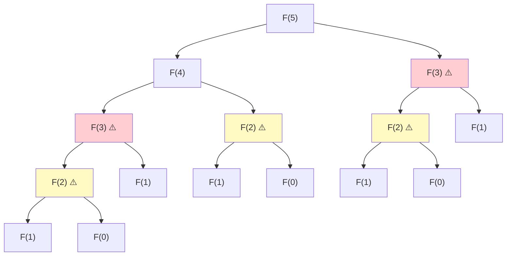
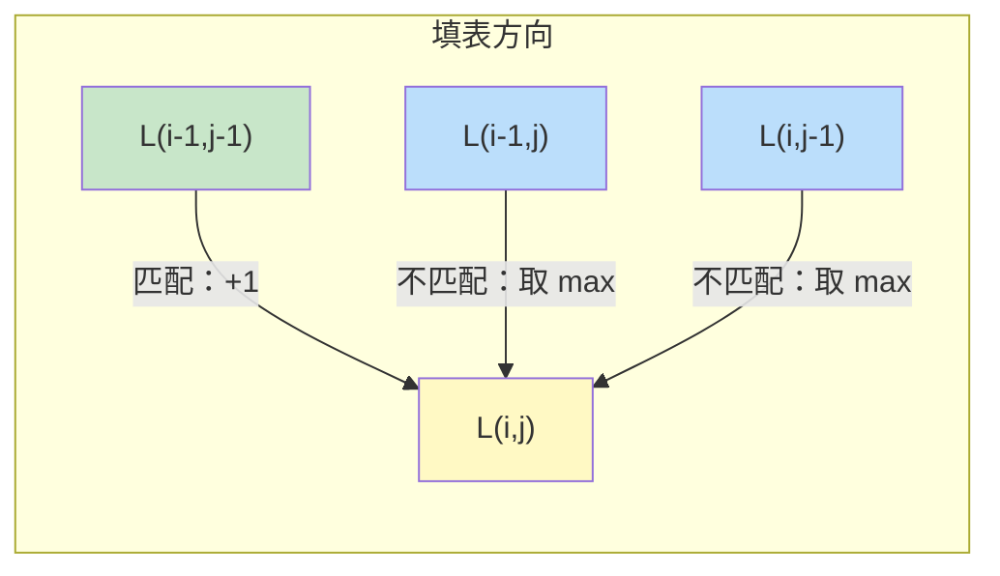
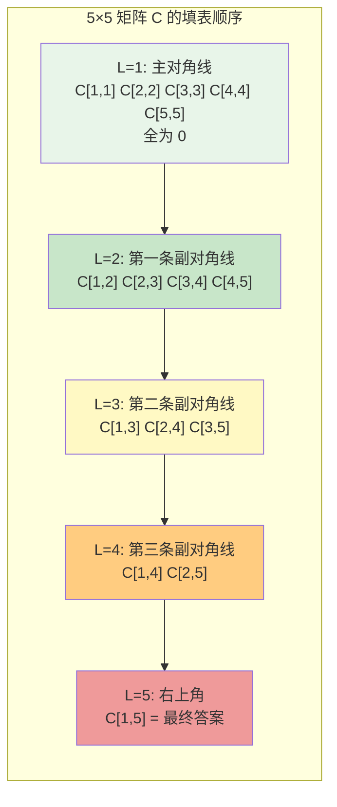
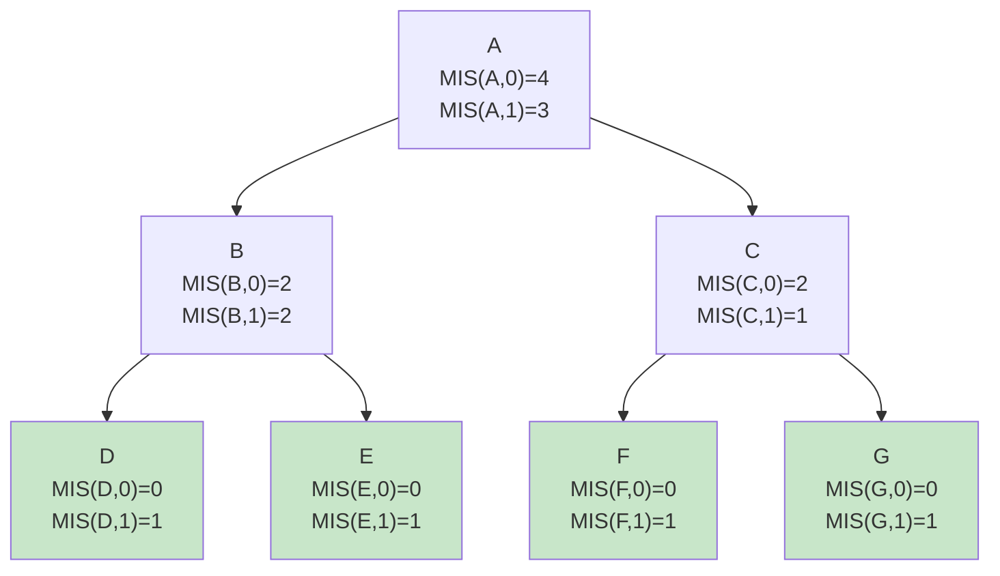
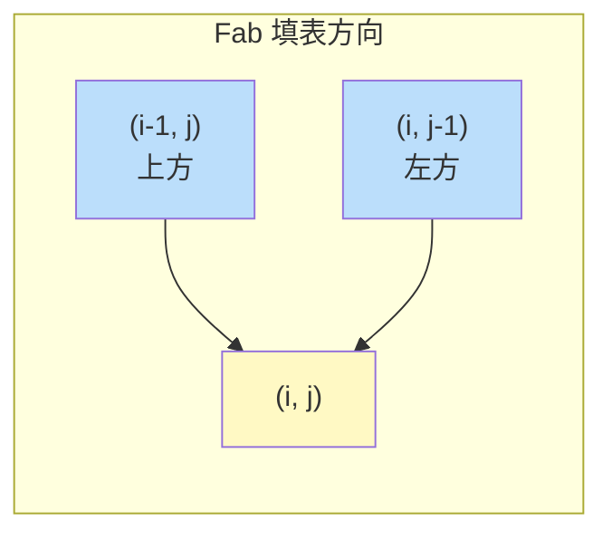

# Chapter 3: 动态规划

> 对应课程 L06-L08：记忆化、序列比对、依赖图、矩阵链乘法与树形 DP

---

## 3.1 Fibonacci 数列分析：从递归到动态规划

### 3.1.1 朴素递归算法的时间复杂度推导

定义 Fibonacci 数列：

$$
F(n) = \begin{cases} 0 & \text{if } n=0 \\ 1 & \text{if } n=1 \\ F(n-1) + F(n-2) & \text{if } n \ge 2 \end{cases}
$$

考虑以下朴素递归算法：

```python
def fib(n):
    if n <= 1: return n
    return fib(n-1) + fib(n-2)
```

**时间复杂度下界证明：**

我们需要严格证明该算法的时间复杂度是指数级的。

设 $T(n)$ 为计算 `fib(n)` 所需的基本运算次数。根据代码逻辑，有递推公式：

$$
T(n) = T(n-1) + T(n-2) + O(1)
$$

其中 $O(1)$ 代表加法运算和条件判断的开销。忽略常数项，关注增长趋势：

$$
T(n) \approx T(n-1) + T(n-2)
$$

由于 $T(n)$ 单调递增（$n$ 越大计算量越大），有 $T(n-1) \ge T(n-2)$，因此可以放缩：

$$
T(n) \ge T(n-2) + T(n-2) = 2T(n-2)
$$

逐步展开：

$$
\begin{aligned}
T(n) &\ge 2 T(n-2) \\
&\ge 2 \cdot 2 T(n-4) = 2^2 T(n-4) \\
&\ge 2^2 \cdot 2 T(n-6) = 2^3 T(n-6) \\
&\;\;\vdots \\
&\ge 2^k T(n-2k)
\end{aligned}
$$

当 $n - 2k = 0$ 时（到达 Base Case），$k = n/2$：

<!-- CHUNK1_PLACEHOLDER -->

$$
T(n) \ge 2^{n/2} \cdot T(0) = 2^{n/2} = (\sqrt{2})^n \approx 1.414^n
$$

这证明了 $T(n) = \Omega(2^{n/2})$，即时间复杂度至少是指数级增长。实际精确解为 $T(n) \approx \phi^n \approx 1.618^n$（$\phi$ 为黄金分割比）。

**F(5) 的递归树**：



> **图示说明**：红色标记的 F(3) 被计算了 2 次，黄色标记的 F(2) 被计算了 3 次。树高为 $n = 5$（对应栈空间 $O(n)$），节点总数呈指数增长。

### 3.1.2 迭代方法与空间优化

为了消除重复计算，我们引入**记忆化**（Memoization）或**迭代填表**（Iterative Table-Filling）。

在迭代做法中，通常使用数组 `DP[0...n]`。但观察状态转移方程：

$$
F(i) = F(i-1) + F(i-2)
$$

计算 $F(i)$ **仅依赖于** $F(i-1)$ 和 $F(i-2)$。这意味着计算 $F(100)$ 时，不需要保留 $F(1)$ 到 $F(97)$ 的值，只需最近两个状态即可。

**空间优化算法**：

```python
def fib_optimized(n):
    if n <= 1: return n
    prev, curr = 0, 1          # prev = F(i-2), curr = F(i-1)
    for i in range(2, n + 1):
        next_val = curr + prev  # F(i) = F(i-1) + F(i-2)
        prev = curr             # 窗口右移
        curr = next_val
    return curr
```

- **时间复杂度**：$O(n)$
- **空间复杂度**：$O(1)$（仅使用 3 个变量）

<!-- CHUNK2_PLACEHOLDER -->

---

## 3.2 最长公共子序列（LCS）

### 3.2.1 问题定义与最优子结构证明

给定序列 $X = x_1 x_2 \dots x_n$ 和 $Y = y_1 y_2 \dots y_m$。

定义 $L(i, j)$ 为前缀 $X_i = x_1 \dots x_i$ 和前缀 $Y_j = y_1 \dots y_j$ 的最长公共子序列长度。

**递推关系及其正确性证明**：

$$
L(i, j) = \begin{cases} 0 & \text{if } i=0 \text{ or } j=0 \\ 1 + L(i-1, j-1) & \text{if } x_i = y_j \\ \max(L(i-1, j),\; L(i, j-1)) & \text{if } x_i \neq y_j \end{cases}
$$

**Case 1：$x_i = y_j$（匹配）**

设 $x_i = y_j = c$。用反证法证明 $c$ 必然属于 LCS：

假设 $Z$ 是 $X_i$ 和 $Y_j$ 的 LCS，但 $Z$ 不以字符 $c$ 结尾。由于 $x_i = y_j = c$，我们可以将 $c$ 追加到 $Z$ 末尾，得到新的公共子序列 $Z'$，其长度为 $|Z| + 1 > |Z|$，与"$Z$ 是 LCS"矛盾。

**结论**：末尾字符相同时，该字符**必然**属于 LCS。问题规约为在 $X_{i-1}$ 和 $Y_{j-1}$ 中找 LCS，长度加 1：$L(i, j) = 1 + L(i-1, j-1)$。

**Case 2：$x_i \neq y_j$（不匹配）**

$x_i$ 和 $y_j$ 不可能**同时**成为同一个公共子序列的结尾字符。只有两种可能：

1. **丢弃 $x_i$**：LCS 存在于 $X_{i-1}$ 和 $Y_j$ 之间，长度为 $L(i-1, j)$
2. **丢弃 $y_j$**：LCS 存在于 $X_i$ 和 $Y_{j-1}$ 之间，长度为 $L(i, j-1)$

> **注意**：不需要单独考虑 $L(i-1, j-1)$，因为 $L(i-1, j) \ge L(i-1, j-1)$ 且 $L(i, j-1) \ge L(i-1, j-1)$（去掉一个字符的解空间包含去掉两个字符的情况）。

**结论**：取两种选择的最大值：$L(i, j) = \max(L(i-1, j),\; L(i, j-1))$。

<!-- CHUNK3_PLACEHOLDER -->

### 3.2.2 填表与回溯

以 $X = \text{"ATGTG"}$（长度 5）和 $Y = \text{"TATG"}$（长度 4）为例，DP 表格如下：

|  | $\emptyset$ | A | T | G | T | G |
|--|:-:|:-:|:-:|:-:|:-:|:-:|
| $\emptyset$ | 0 | 0 | 0 | 0 | 0 | 0 |
| **T** | 0 | 0 | **1** | 1 | **1** | 1 |
| **A** | 0 | **1** | 1 | 1 | 1 | 1 |
| **T** | 0 | 1 | **2** | 2 | 2 | 2 |
| **G** | 0 | 1 | 2 | **3** | 3 | **3** |

**填表规则**：



- 若 $x_j = y_i$（匹配），值 = 左上角 + 1，画**对角线箭头**
- 若 $x_j \neq y_i$（不匹配），值 = max(左边, 上边)，画箭头指向较大值来源

**回溯重建 LCS**：

1. 从右下角 $(m, n)$ 开始
2. 沿箭头逆流而上
3. **关键规则**：只有沿"对角线箭头"（匹配情况）移动时，才记录当前字符
4. LCS 是逆序生成的，最后需要反转

上例中回溯路径为：$(4,5) \to (4,4) \to (3,3) \xrightarrow{\text{匹配 T}} (2,2) \xrightarrow{\text{匹配 A}} (1,1) \to (1,0)$... 最终 LCS = "ATG"（长度 3）。

**复杂度**：时间 $O(nm)$，空间 $O(nm)$（可优化为 $O(\min(n,m))$，但会丢失回溯能力）。

<!-- CHUNK4_PLACEHOLDER -->

---

## 3.3 矩阵链乘法（MCM）

### 3.3.1 为什么顺序很重要

给定矩阵链 $A_1, A_2, \dots, A_n$。虽然矩阵乘法满足结合律（$(AB)C = A(BC)$），但**标量乘法次数**可能有天壤之别。

**反例**：设矩阵维度为 $A: 10 \times 100$，$B: 100 \times 5$，$C: 5 \times 50$。

| 方案 | 步骤 | 代价 | 总计 |
|------|------|------|------|
| $(A \times B) \times C$ | $AB$: $10 \times 100 \times 5 = 5{,}000$；$(AB)C$: $10 \times 5 \times 50 = 2{,}500$ | **7,500** |
| $A \times (B \times C)$ | $BC$: $100 \times 5 \times 50 = 25{,}000$；$A(BC)$: $10 \times 100 \times 50 = 50{,}000$ | **75,000** |

方案二比方案一慢了 **10 倍**。这就是为什么需要 DP 来寻找最优括号化方案。

### 3.3.2 带分割点的递推推导

定义 $C[i, j]$ 为计算矩阵子链 $A_i \dots A_j$ 的最小代价。设矩阵 $A_k$ 的维度为 $p_{k-1} \times p_k$。

对于任意区间 $[i, j]$，最后一次乘法必然发生在某个分割点 $k$（$i \le k < j$），将链条分为两部分：

$$
(A_i \dots A_k) \times (A_{k+1} \dots A_j)
$$

总代价分解为三部分：

1. **左子问题**：计算 $A_i \dots A_k$ 的最小代价 → $C[i, k]$
2. **右子问题**：计算 $A_{k+1} \dots A_j$ 的最小代价 → $C[k+1, j]$
3. **合并代价**：左结果（$p_{i-1} \times p_k$）乘以右结果（$p_k \times p_j$）→ $p_{i-1} \cdot p_k \cdot p_j$

遍历所有可能的 $k$ 取最小值：

$$
C[i, j] = \min_{i \le k < j} \big\{ C[i, k] + C[k+1, j] + p_{i-1} \cdot p_k \cdot p_j \big\}
$$

**Base Case**：$C[i, i] = 0$（单个矩阵无需乘法）。

<!-- CHUNK5_PLACEHOLDER -->

### 3.3.3 对角线迭代策略

**为什么不能用常规的 `for i, for j` 循环？**

观察公式：计算 $C[i,j]$ 需要 $C[i,k]$（第 $i$ 行左边的格子）和 $C[k+1,j]$（第 $j$ 列下边的格子）。这意味着计算长度为 $L$ 的区间时，必须保证所有长度 $< L$ 的区间都已计算完毕。

**正确的迭代顺序——按区间长度对角线填表**：



**实现代码**：

```python
def matrix_chain(p):
    n = len(p) - 1  # n 个矩阵
    C = [[0] * (n + 1) for _ in range(n + 1)]

    for length in range(2, n + 1):          # 区间长度从 2 到 n
        for i in range(1, n - length + 2):  # 起点
            j = i + length - 1              # 终点
            C[i][j] = float('inf')
            for k in range(i, j):           # 分割点
                cost = C[i][k] + C[k+1][j] + p[i-1] * p[k] * p[j]
                C[i][j] = min(C[i][j], cost)

    return C[1][n]
```

**复杂度**：时间 $O(n^3)$（三重循环），空间 $O(n^2)$。

<!-- CHUNK6_PLACEHOLDER -->

---

## 3.4 背包问题：状态定义的细微差别

### 3.4.1 完全背包 vs 0/1 背包

**问题**：有 $n$ 种物品，重量 $w_i$，价值 $v_i$，背包容量 $B$。

#### 变体 A：完全背包（Unbounded Knapsack）

**定义**：每种物品可以取无限次。

**状态**：$K[b]$ 表示容量为 $b$ 时的最大价值。

**推导**：为了填满容量 $b$，考虑**最后一次**放入的是哪个物品 $i$。剩余容量 $b - w_i$ 必须被最优地填满。因为物品可以重复选，子问题仍然是"在所有物品中选择，填满 $b - w_i$"：

$$
K[b] = \max_{i:\; w_i \le b} \big\{ K[b - w_i] + v_i \big\}
$$

#### 变体 B：0/1 背包（0/1 Knapsack）

**定义**：每种物品最多只能选 1 次。

**为什么上面的公式失效？** 如果继续用 $K[b]$，调用 $K[b - w_i]$ 时无法知道物品 $i$ 是否已被使用，违反了**无后效性**。

**新状态定义**：$K[i, b]$ 表示**仅考虑前 $i$ 个物品**、容量为 $b$ 时的最大价值。

**转移逻辑**：对于第 $i$ 个物品，只有两个选择：

1. **不选物品 $i$**：问题转化为"用前 $i-1$ 个物品填满容量 $b$" → $K[i-1, b]$
2. **选物品 $i$**：获得价值 $v_i$，消耗重量 $w_i$，剩余容量用前 $i-1$ 个物品填满 → $K[i-1, b - w_i] + v_i$

$$
K[i, b] = \max \begin{cases} K[i-1, b] & \text{（不选）} \\ K[i-1, b-w_i] + v_i & \text{（选，仅当 } w_i \le b\text{）} \end{cases}
$$

**Base Case**：$K[0, b] = 0$（没有物品可选）。

**复杂度**：时间 $O(nB)$，空间 $O(nB)$（可优化为 $O(B)$，但需**逆序**遍历 $b$）。

> **注意**：$O(nB)$ 是**伪多项式时间**（pseudo-polynomial），因为 $B$ 的二进制表示长度为 $\log B$，所以相对于输入大小是指数级的。

<!-- CHUNK7_PLACEHOLDER -->

---

## 3.5 树形 DP：最大独立集（MIS）

### 3.5.1 问题与状态推导

**定义**：在树 $T$ 中选择一个节点子集，使得子集中任意两个节点都不相邻（没有边相连），目标是最大化子集大小。

由于树没有环，可以选定任意节点为根，将问题转化为有向的层级依赖。DP 的顺序是**后序遍历**（Post-order Traversal）：先子节点，后父节点。

**状态定义**：对于每个节点 $u$，单一状态 $MIS(u)$ 不够，因为父节点能否被选取决于子节点的选取情况。需要区分两种状态：

1. $MIS(u, 0)$：以 $u$ 为根的子树中，**强制不选** $u$ 时的最大独立集大小
2. $MIS(u, 1)$：以 $u$ 为根的子树中，**强制选择** $u$ 时的最大独立集大小

### 3.5.2 转移逻辑

**Case 1：$MIS(u, 0)$（不选 $u$）**

$u$ 不被选中，则每个子节点 $v$ 不受限制，可选可不选。为最大化总数，对每个子节点取两种状态的最大值：

$$
MIS(u, 0) = \sum_{v \in \text{children}(u)} \max\!\big(MIS(v, 0),\; MIS(v, 1)\big)
$$

**Case 2：$MIS(u, 1)$（选 $u$）**

$u$ 被选中，根据独立集定义，所有直接子节点 $v$ **绝对不能**被选中。加上 $u$ 自身贡献的 1：

$$
MIS(u, 1) = 1 + \sum_{v \in \text{children}(u)} MIS(v, 0)
$$

**最终答案**：

$$
\max\!\big(MIS(\text{root}, 0),\; MIS(\text{root}, 1)\big)
$$

**示例**：



> **图示说明**：叶子节点 D, E, F, G 的 $MIS(\cdot, 0) = 0$，$MIS(\cdot, 1) = 1$。节点 B：$MIS(B, 0) = \max(0,1) + \max(0,1) = 2$，$MIS(B, 1) = 1 + 0 + 0 = 1$... 等等，这里 $MIS(B,1) = 1 + MIS(D,0) + MIS(E,0) = 1 + 0 + 0 = 1$。但如果不选 B，可以选 D 和 E，得到 2。最终 $MIS(A, 0) = \max(2,1) + \max(2,1) = 4$（选 B 的不选状态 2 + C 的不选状态 2），$MIS(A, 1) = 1 + 2 + 0 = 3$... 答案为 $\max(4, 3) = 4$，即选 {D, E, F, G}。

**复杂度**：时间 $O(n)$，空间 $O(n)$（每个节点访问一次）。

<!-- CHUNK8_PLACEHOLDER -->

---

## 3.6 备考练习：Recitation 题目

### 3.6.1 "Fab" 数（二维递推）

**递推关系**：

$$
Fab(i, j) = \begin{cases} Fab(i, j\!-\!1) + Fab(i, j\!-\!2) & \text{if } i=1,\; j \ge 3 \\ Fab(i\!-\!1, j) + Fab(i\!-\!2, j\!-\!1) & \text{if } i \ge 2,\; j=1 \\ Fab(i\!-\!1, j) + Fab(i, j\!-\!1) & \text{if } i \ge 2,\; j \ge 2 \end{cases}
$$

**无记忆化的时间复杂度分析**：

即使是二维递推，只要每个状态分叉为两个递归调用且问题规模每次仅减 1，就是指数级的。

- 递归树深度 $\approx n + n = 2n$（从 $(n,n)$ 走到 $(1,1)$）
- 总调用次数 $\approx 2^{2n} = 4^n$

**DP 迭代顺序**：

$Fab(i, j)$ 依赖于 $Fab(i-1, j)$（上方）和 $Fab(i, j-1)$（左方），与网格路径问题完全一致。按**逐行从上到下、从左到右**的顺序填表即可。



- **时间**：$O(n^2)$（填满 $n \times n$ 表格）
- **空间**：$O(n^2)$ → 可优化为 $O(n)$（只需保留上一行）

### 3.6.2 最长回文子串

**状态**：$D[i, j] = \text{True}$ 表示子串 $S[i \dots j]$ 是回文。

**推导**：字符串 $S[i \dots j]$ 是回文，当且仅当：

1. 首尾字符相同：$S[i] = S[j]$
2. 去掉首尾后的内部子串 $S[i+1 \dots j-1]$ 也是回文

$$
D[i, j] = (S[i] = S[j]) \;\land\; D[i+1, j-1]
$$

**Base Cases**：

1. 长度 1：$D[i, i] = \text{True}$（单个字符总是回文）
2. 长度 2：$D[i, i+1] = (S[i] = S[i+1])$

**迭代顺序**：必须按**区间长度从小到大**遍历（与矩阵链乘法相同），因为 $D[i, j]$ 依赖于 $D[i+1, j-1]$（更短的区间）。不能简单地用 `for i, for j`。

**复杂度**：时间 $O(n^2)$（填满上三角矩阵），空间 $O(n^2)$。

---
