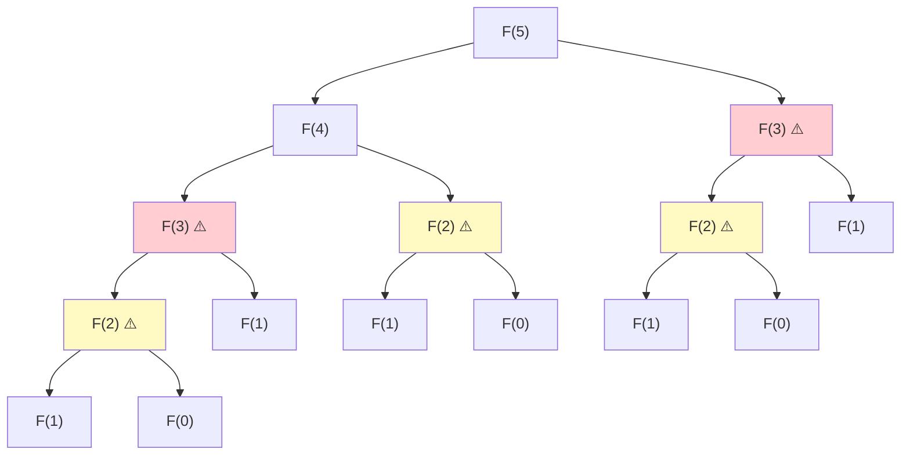
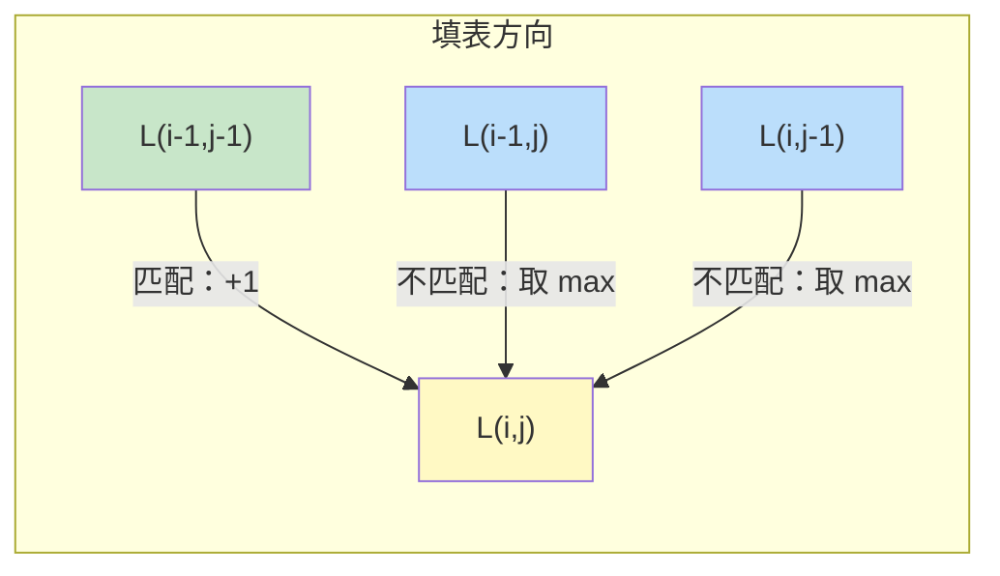
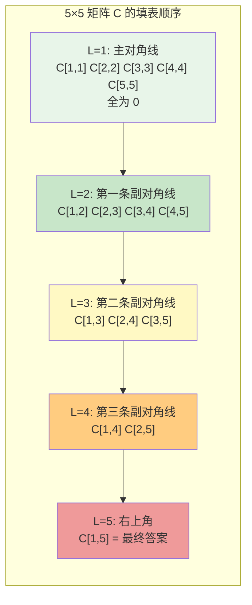
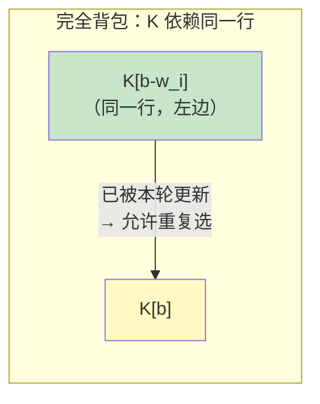
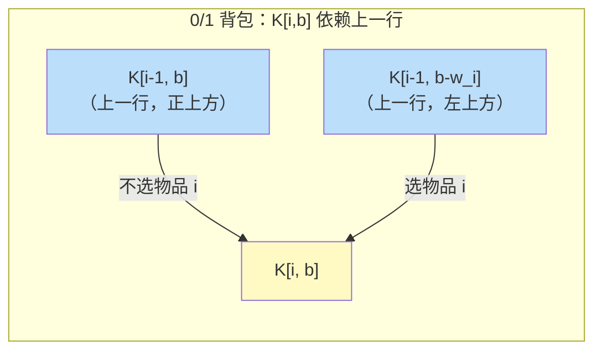
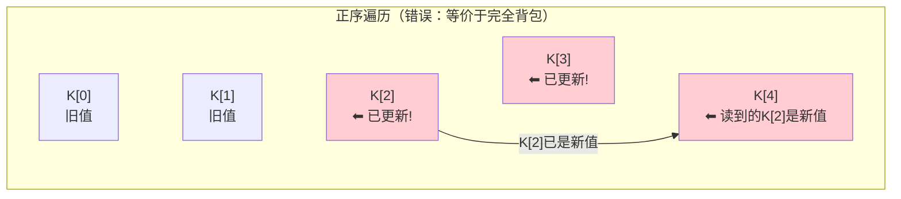
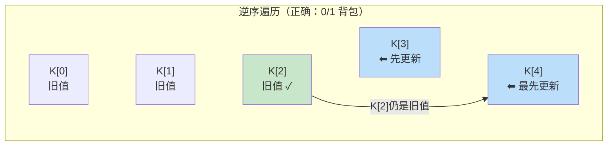
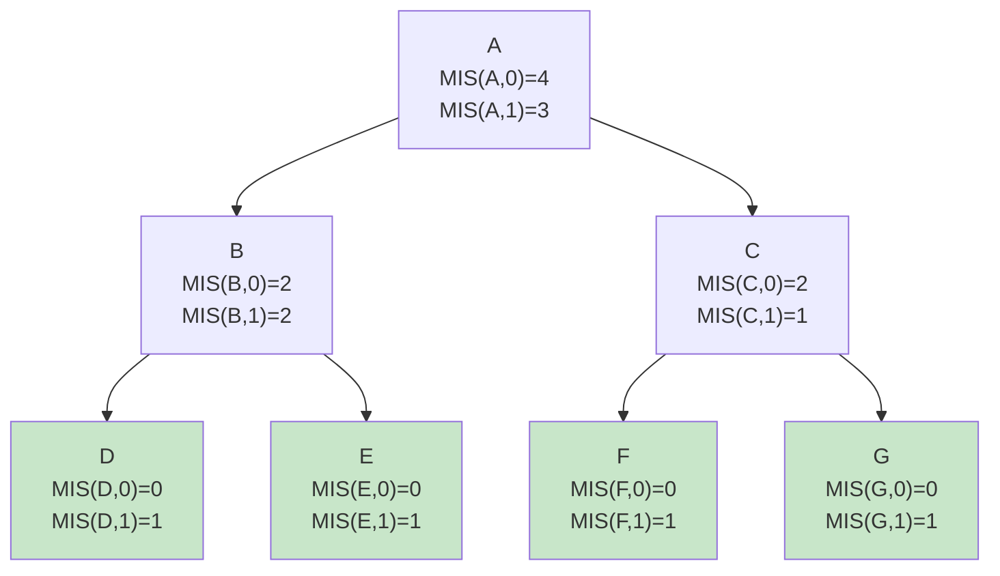
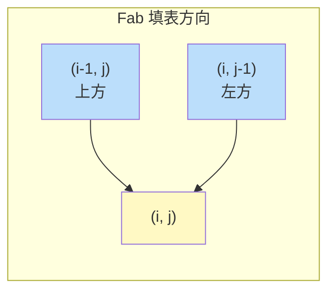

# Chapter 3: 动态规划

> 对应课程 L06-L08：记忆化、序列比对、依赖图、矩阵链乘法与树形 DP

---

## 3.1 Fibonacci 数列分析：从递归到动态规划

### 3.1.1 朴素递归算法的时间复杂度推导

定义 Fibonacci 数列：

$$
F(n) = \begin{cases} 0 & \text{if } n=0 \\ 1 & \text{if } n=1 \\ F(n-1) + F(n-2) & \text{if } n \ge 2 \end{cases}
$$

考虑以下朴素递归算法：

```python
def fib(n):
    if n <= 1: return n
    return fib(n-1) + fib(n-2)
```

**时间复杂度下界证明：**

我们需要严格证明该算法的时间复杂度是指数级的。

设 $T(n)$ 为计算 `fib(n)` 所需的基本运算次数。根据代码逻辑，有递推公式：

$$
T(n) = T(n-1) + T(n-2) + O(1)
$$

其中 $O(1)$ 代表加法运算和条件判断的开销。忽略常数项，关注增长趋势：

$$
T(n) \approx T(n-1) + T(n-2)
$$

由于 $T(n)$ 单调递增（$n$ 越大计算量越大），有 $T(n-1) \ge T(n-2)$，因此可以放缩：

$$
T(n) \ge T(n-2) + T(n-2) = 2T(n-2)
$$

逐步展开：

$$
\begin{aligned}
T(n) &\ge 2 T(n-2) \\
&\ge 2 \cdot 2 T(n-4) = 2^2 T(n-4) \\
&\ge 2^2 \cdot 2 T(n-6) = 2^3 T(n-6) \\
&\;\;\vdots \\
&\ge 2^k T(n-2k)
\end{aligned}
$$

当 $n - 2k = 0$ 时（到达 Base Case），$k = n/2$：

<!-- CHUNK1_PLACEHOLDER -->

$$
T(n) \ge 2^{n/2} \cdot T(0) = 2^{n/2} = (\sqrt{2})^n \approx 1.414^n
$$

这证明了 $T(n) = \Omega(2^{n/2})$，即时间复杂度至少是指数级增长。实际精确解为 $T(n) \approx \phi^n \approx 1.618^n$（$\phi$ 为黄金分割比）。

**F(5) 的递归树**：



> **图示说明**：红色标记的 F(3) 被计算了 2 次，黄色标记的 F(2) 被计算了 3 次。树高为 $n = 5$（对应栈空间 $O(n)$），节点总数呈指数增长。

### 3.1.2 迭代方法与空间优化

为了消除重复计算，我们引入**记忆化**（Memoization）或**迭代填表**（Iterative Table-Filling）。

在迭代做法中，通常使用数组 `DP[0...n]`。但观察状态转移方程：

$$
F(i) = F(i-1) + F(i-2)
$$

计算 $F(i)$ **仅依赖于** $F(i-1)$ 和 $F(i-2)$。这意味着计算 $F(100)$ 时，不需要保留 $F(1)$ 到 $F(97)$ 的值，只需最近两个状态即可。

**空间优化算法**：

```python
def fib_optimized(n):
    if n <= 1: return n
    prev, curr = 0, 1          # prev = F(i-2), curr = F(i-1)
    for i in range(2, n + 1):
        next_val = curr + prev  # F(i) = F(i-1) + F(i-2)
        prev = curr             # 窗口右移
        curr = next_val
    return curr
```

- **时间复杂度**：$O(n)$
- **空间复杂度**：$O(1)$（仅使用 3 个变量）

<!-- CHUNK2_PLACEHOLDER -->

---

## 3.2 动态规划的通用解题框架

在学习了 Fibonacci 这个最简单的 DP 实例后，我们来总结一套**通用的解题思路**。后续所有 DP 问题（LCS、MCM、背包、树形 DP）都将遵循这个框架。

### 3.2.1 DP 的四个核心步骤

解决任何 DP 问题，都可以按以下四步走：

| 步骤 | 关键问题 | Fibonacci 示例 |
|------|---------|---------------|
| **1. 定义子问题** | $DP[\cdot]$ 的含义是什么？ | $F[i]$ = 第 $i$ 个 Fibonacci 数 |
| **2. 写出递推关系** | 大问题如何由子问题组合？ | $F[i] = F[i-1] + F[i-2]$ |
| **3. 确定计算顺序** | 计算 $DP[i]$ 时依赖项是否已就绪？ | 从 $i=2$ 到 $i=n$，顺序递增 |
| **4. 提取最终答案** | 答案在 DP 表的哪个位置？ | $F[n]$ |

**步骤 1：定义子问题（Subproblem）**

用自然语言和数学符号**精确定义** $DP[i]$（或 $DP[i][j]$）的含义。这是最关键的一步——子问题定义错了，后面全白费。

**步骤 2：写出递推关系（Recurrence）**

基于**最优子结构**，将大问题分解为子问题的组合。通常的思路是：**考虑最后一步做了什么决策**，然后枚举所有可能的决策。

**步骤 3：确定计算顺序（Order）**

分析依赖关系，确保计算 $DP[i]$ 时所有依赖项已经计算完毕。常见模式：
- 一维从左到右（Fibonacci、背包）
- 二维逐行从上到下（LCS）
- 按区间长度从小到大（MCM）
- 后序遍历（树形 DP）

**步骤 4：提取最终答案（Answer）**

答案**不一定**在 DP 表的最后一个格子。例如：
- Fibonacci：$F[n]$（最后一个）
- LCS：$L[m][n]$（右下角）
- 最长递增子序列（LIS）：$\max_i DP[i]$（需要遍历整个数组取最大值）

### 3.2.2 如何定义子问题

子问题的定义方式决定了整个 DP 的结构。常见的模式有：

**前缀型**：$DP[i]$ = 考虑前 $i$ 个元素的最优解
- 适用场景：背包、LIS、Fibonacci
- 特点：子问题数量 $O(n)$，通常从左到右填表

**区间型**：$DP[i][j]$ = 区间 $[i, j]$ 上的最优解
- 适用场景：矩阵链乘法、最长回文子串
- 特点：子问题数量 $O(n^2)$，按区间长度从小到大填表

**双序列型**：$DP[i][j]$ = 序列 $X$ 的前 $i$ 个元素与序列 $Y$ 的前 $j$ 个元素的最优解
- 适用场景：LCS、编辑距离
- 特点：子问题数量 $O(nm)$，逐行填表

**树形**：$DP[u][\cdot]$ = 以节点 $u$ 为根的子树上的最优解
- 适用场景：树上最大独立集、树的直径
- 特点：子问题数量 $O(n)$，后序遍历

> **经验法则**：如果一维状态不够用（无法区分"物品 $i$ 是否已使用"），就加一维。0/1 背包从 $K[b]$ 升级到 $K[i,b]$ 就是典型例子。

### 3.2.3 最优子结构与无后效性

DP 能正确工作，依赖于两个关键性质：

**最优子结构（Optimal Substructure）**

大问题的最优解**包含**子问题的最优解。换句话说，如果我们知道了最优解的"最后一步决策"，那么去掉这一步后，剩余部分也必须是对应子问题的最优解。

- Fibonacci：$F(n) = F(n-1) + F(n-2)$，大问题直接由子问题相加
- LCS：如果末尾字符匹配，LCS 包含该字符 + 去掉末尾后的 LCS
- 背包：如果最优解选了物品 $i$，那么剩余容量的填法也必须是最优的

**无后效性（No Aftereffect）**

子问题的解**只取决于子问题本身的定义**，不依赖于"未来"的决策。也就是说，一旦 $DP[i]$ 的值确定了，它不会因为后续的决策而改变。

反例：为什么 0/1 背包不能用 $K[b]$？因为 $K[b-w_i]$ 的值取决于"物品 $i$ 是否已经被选过"——这是一个"未来"信息（从子问题的视角看），违反了无后效性。解决方法是加一维：$K[i, b]$ 明确记录了"只考虑前 $i$ 个物品"，消除了对未来的依赖。

### 3.2.4 时间复杂度公式

DP 算法的时间复杂度有一个简洁的通用公式：

$$
T = (\text{子问题数量}) \times (\text{每个子问题的计算时间})
$$

用本章的例子来验证：

| 问题 | 子问题数量 | 每个子问题时间 | 总时间 |
|------|-----------|--------------|--------|
| Fibonacci | $n$ | $O(1)$ | $O(n)$ |
| LCS | $nm$ | $O(1)$ | $O(nm)$ |
| MCM | $O(n^2)$ 个区间 | $O(n)$（枚举分割点） | $O(n^3)$ |
| 0/1 背包 | $nB$ | $O(1)$ | $O(nB)$ |
| 完全背包 | $B$ | $O(n)$（枚举物品） | $O(nB)$ |
| 树形 MIS | $2n$（每个节点 2 个状态） | $O(\text{子节点数})$ | $O(n)$（总和为边数） |

> **注意**：这个公式假设没有重复计算（即使用了记忆化或迭代填表）。朴素递归之所以慢，正是因为同一个子问题被反复求解。

---

## 3.3 最长公共子序列（LCS）

### 3.3.1 问题定义与最优子结构证明

**子序列 vs 子串**：

- **子串（Substring）**：必须是**连续**的字符片段。例如 "bcd" 是 "abcde" 的子串。
- **子序列（Subsequence）**：可以**不连续**，但必须保持原有的相对顺序。例如 "ace" 是 "abcde" 的子序列（删除 b、d 得到），但 "aec" 不是（顺序错误）。

**问题定义**：给定两个序列 $X = x_1 x_2 \dots x_n$ 和 $Y = y_1 y_2 \dots y_m$，找出它们的**最长公共子序列**（Longest Common Subsequence, LCS），即同时是 $X$ 和 $Y$ 的子序列且长度最大的序列。

**示例**：$X = \text{"ABCBDAB"}$，$Y = \text{"BDCABA"}$，LCS 为 "BCBA" 或 "BDAB"（长度均为 4）。

**状态定义**：$L(i, j)$ 为前缀 $X_i = x_1 \dots x_i$ 和前缀 $Y_j = y_1 \dots y_j$ 的最长公共子序列长度。

**递推关系及其正确性证明**：

$$
L(i, j) = \begin{cases} 0 & \text{if } i=0 \text{ or } j=0 \\ 1 + L(i-1, j-1) & \text{if } x_i = y_j \\ \max(L(i-1, j),\; L(i, j-1)) & \text{if } x_i \neq y_j \end{cases}
$$

**Case 1：$x_i = y_j$（匹配）**

设 $x_i = y_j = c$。用反证法证明 $c$ 必然属于 LCS：

假设 $Z$ 是 $X_i$ 和 $Y_j$ 的 LCS，但 $Z$ 不以字符 $c$ 结尾。由于 $x_i = y_j = c$，我们可以将 $c$ 追加到 $Z$ 末尾，得到新的公共子序列 $Z'$，其长度为 $|Z| + 1 > |Z|$，与"$Z$ 是 LCS"矛盾。

**结论**：末尾字符相同时，该字符**必然**属于 LCS。问题规约为在 $X_{i-1}$ 和 $Y_{j-1}$ 中找 LCS，长度加 1：$L(i, j) = 1 + L(i-1, j-1)$。

**Case 2：$x_i \neq y_j$（不匹配）**

$x_i$ 和 $y_j$ 不可能**同时**成为同一个公共子序列的结尾字符。只有两种可能：

1. **丢弃 $x_i$**：LCS 存在于 $X_{i-1}$ 和 $Y_j$ 之间，长度为 $L(i-1, j)$
2. **丢弃 $y_j$**：LCS 存在于 $X_i$ 和 $Y_{j-1}$ 之间，长度为 $L(i, j-1)$

> **注意**：不需要单独考虑 $L(i-1, j-1)$，因为 $L(i-1, j) \ge L(i-1, j-1)$ 且 $L(i, j-1) \ge L(i-1, j-1)$（去掉一个字符的解空间包含去掉两个字符的情况）。

**结论**：取两种选择的最大值：$L(i, j) = \max(L(i-1, j),\; L(i, j-1))$。

<!-- CHUNK3_PLACEHOLDER -->

### 3.3.2 填表与回溯

以 $X = \text{"ATGTG"}$（长度 5）和 $Y = \text{"TATG"}$（长度 4）为例，DP 表格如下：

|  | $\emptyset$ | A | T | G | T | G |
|--|:-:|:-:|:-:|:-:|:-:|:-:|
| $\emptyset$ | 0 | 0 | 0 | 0 | 0 | 0 |
| **T** | 0 | 0 | **1** | 1 | **1** | 1 |
| **A** | 0 | **1** | 1 | 1 | 1 | 1 |
| **T** | 0 | 1 | **2** | 2 | 2 | 2 |
| **G** | 0 | 1 | 2 | **3** | 3 | **3** |

**填表规则**：



- 若 $x_j = y_i$（匹配），值 = 左上角 + 1，画**对角线箭头**
- 若 $x_j \neq y_i$（不匹配），值 = max(左边, 上边)，画箭头指向较大值来源

**回溯重建 LCS**：

1. 从右下角 $(m, n)$ 开始
2. 沿箭头逆流而上
3. **关键规则**：只有沿"对角线箭头"（匹配情况）移动时，才记录当前字符
4. LCS 是逆序生成的，最后需要反转

上例中回溯路径为：$(4,5) \to (4,4) \to (3,3) \xrightarrow{\text{匹配 T}} (2,2) \xrightarrow{\text{匹配 A}} (1,1) \to (1,0)$... 最终 LCS = "ATG"（长度 3）。

**Python 实现**：

```python
def lcs(X, Y):
    n, m = len(X), len(Y)
    # L[i][j] = LCS 长度，X[0..i-1] 与 Y[0..j-1]
    L = [[0] * (m + 1) for _ in range(n + 1)]

    for i in range(1, n + 1):
        for j in range(1, m + 1):
            if X[i - 1] == Y[j - 1]:          # 匹配
                L[i][j] = 1 + L[i - 1][j - 1]
            else:                               # 不匹配，取较大值
                L[i][j] = max(L[i - 1][j], L[i][j - 1])

    return L[n][m]
```

**复杂度分析**：

- **时间**：$O(nm)$。双重循环分别遍历 $n$ 行和 $m$ 列，每个单元格内的比较和取 max 操作均为 $O(1)$。
- **空间**：$O(nm)$。需要一个 $(n+1) \times (m+1)$ 的二维表格。若只需长度不需回溯，可优化为 $O(\min(n,m))$（只保留两行）。

<!-- CHUNK4_PLACEHOLDER -->

### 3.3.3 编辑距离（Edit Distance）

**问题定义**：给定两个字符串 $X[1 \dots n]$ 和 $Y[1 \dots m]$，求将 $X$ 变换为 $Y$ 所需的最少编辑操作次数。允许的操作有三种：

1. **插入**（Insert）：在 $X$ 中插入一个字符
2. **删除**（Delete）：从 $X$ 中删除一个字符
3. **替换**（Substitute）：将 $X$ 中的一个字符替换为另一个字符

**状态定义**：$E[i, j]$ = 将 $X[1 \dots i]$ 变换为 $Y[1 \dots j]$ 的最小编辑距离。

**递推关系**：

$$
E[i, j] = \begin{cases}
i & \text{if } j = 0 \text{（删除 } i \text{ 个字符）} \\
j & \text{if } i = 0 \text{（插入 } j \text{ 个字符）} \\
\min\!\begin{cases}
E[i\!-\!1, j] + 1 & \text{（删除 } X[i] \text{）} \\
E[i, j\!-\!1] + 1 & \text{（插入 } Y[j] \text{）} \\
E[i\!-\!1, j\!-\!1] + \mathbb{1}(X[i] \neq Y[j]) & \text{（替换/匹配）}
\end{cases} & \text{otherwise}
\end{cases}
$$

其中 $\mathbb{1}(X[i] \neq Y[j])$ 表示：若 $X[i] = Y[j]$ 则代价为 0（无需操作），否则代价为 1（替换）。

**填表举例**：将 $X = \text{"SAT"}$ 变换为 $Y = \text{"SUN"}$。

| $E[i,j]$ | $\emptyset$ | S | U | N |
|-----------|:-:|:-:|:-:|:-:|
| $\emptyset$ | 0 | 1 | 2 | 3 |
| **S** | 1 | **0** | 1 | 2 |
| **A** | 2 | 1 | **1** | 2 |
| **T** | 3 | 2 | 2 | **2** |

填表过程（关键单元格）：

- $E[1,1]$：$S = S$（匹配），$E[0,0] + 0 = 0$
- $E[2,2]$：$A \neq U$，$\min(E[1,2]+1,\; E[2,1]+1,\; E[1,1]+1) = \min(2, 2, 1) = 1$（替换 A→U）
- $E[3,3]$：$T \neq N$，$\min(E[2,3]+1,\; E[3,2]+1,\; E[2,2]+1) = \min(3, 3, 2) = 2$（替换 T→N）

最终 $E[3,3] = 2$，即需要 2 次替换操作（A→U, T→N）。

**Python 实现**：

```python
def edit_distance(X, Y):
    n, m = len(X), len(Y)
    E = [[0] * (m + 1) for _ in range(n + 1)]

    # Base Cases
    for i in range(n + 1):
        E[i][0] = i    # 删除 i 个字符
    for j in range(m + 1):
        E[0][j] = j    # 插入 j 个字符

    for i in range(1, n + 1):
        for j in range(1, m + 1):
            cost = 0 if X[i - 1] == Y[j - 1] else 1
            E[i][j] = min(
                E[i - 1][j] + 1,        # 删除
                E[i][j - 1] + 1,        # 插入
                E[i - 1][j - 1] + cost  # 替换/匹配
            )

    return E[n][m]
```

**复杂度分析**：

- **时间**：$O(nm)$。双重循环遍历整个 $(n+1) \times (m+1)$ 表格，每个单元格内的三路取 min 操作为 $O(1)$。
- **空间**：$O(nm)$。需要存储完整的二维表格。若只需最终距离值，可优化为 $O(\min(n,m))$（只保留两行）。

---

## 3.4 矩阵链乘法（MCM）

### 3.4.1 为什么顺序很重要

**问题定义**：给定 $n$ 个矩阵组成的链 $A_1, A_2, \dots, A_n$，其中矩阵 $A_k$ 的维度为 $p_{k-1} \times p_k$。目标是找到一种**括号化方案**（即确定乘法的计算顺序），使得计算整个矩阵链乘积 $A_1 A_2 \cdots A_n$ 所需的**标量乘法总次数最少**。

**背景知识**：两个矩阵 $A$（$p \times q$）和 $B$（$q \times r$）相乘，结果矩阵维度为 $p \times r$，需要 $p \cdot q \cdot r$ 次标量乘法。矩阵乘法满足结合律（$(AB)C = A(BC)$），但不同的括号化方案对应的标量乘法次数可能有天壤之别。

**反例**：设矩阵维度为 $A: 10 \times 100$，$B: 100 \times 5$，$C: 5 \times 50$。

| 方案 | 步骤 | 代价 | 总计 |
|------|------|------|------|
| $(A \times B) \times C$ | $AB$: $10 \times 100 \times 5 = 5{,}000$；$(AB)C$: $10 \times 5 \times 50 = 2{,}500$ | **7,500** |
| $A \times (B \times C)$ | $BC$: $100 \times 5 \times 50 = 25{,}000$；$A(BC)$: $10 \times 100 \times 50 = 50{,}000$ | **75,000** |

方案二比方案一慢了 **10 倍**。这就是为什么需要 DP 来寻找最优括号化方案。

### 3.4.2 带分割点的递推推导

定义 $C[i, j]$ 为计算矩阵子链 $A_i \dots A_j$ 的最小代价。设矩阵 $A_k$ 的维度为 $p_{k-1} \times p_k$。

对于任意区间 $[i, j]$，最后一次乘法必然发生在某个分割点 $k$（$i \le k < j$），将链条分为两部分：

$$
(A_i \dots A_k) \times (A_{k+1} \dots A_j)
$$

总代价分解为三部分：

1. **左子问题**：计算 $A_i \dots A_k$ 的最小代价 → $C[i, k]$
2. **右子问题**：计算 $A_{k+1} \dots A_j$ 的最小代价 → $C[k+1, j]$
3. **合并代价**：左结果（$p_{i-1} \times p_k$）乘以右结果（$p_k \times p_j$）→ $p_{i-1} \cdot p_k \cdot p_j$

遍历所有可能的 $k$ 取最小值：

$$
C[i, j] = \min_{i \le k < j} \big\{ C[i, k] + C[k+1, j] + p_{i-1} \cdot p_k \cdot p_j \big\}
$$

**Base Case**：$C[i, i] = 0$（单个矩阵无需乘法）。

**填表举例**：4 个矩阵，维度向量 $p = [10, 30, 5, 60]$，即 $A_1: 10 \times 30$，$A_2: 30 \times 5$，$A_3: 5 \times 60$。

| $C[i,j]$ | 1 | 2 | 3 |
|-----------|:-:|:-:|:-:|
| **1** | 0 | 1500 | **4500** |
| **2** | — | 0 | 9000 |
| **3** | — | — | 0 |

填表过程（按区间长度）：

- $L = 1$（主对角线）：$C[1,1] = C[2,2] = C[3,3] = 0$
- $L = 2$：
  - $C[1,2]$：$k=1$，$C[1,1] + C[2,2] + 10 \times 30 \times 5 = 1500$
  - $C[2,3]$：$k=2$，$C[2,2] + C[3,3] + 30 \times 5 \times 60 = 9000$
- $L = 3$：
  - $C[1,3]$：$k=1$，$C[1,1] + C[2,3] + 10 \times 30 \times 60 = 0 + 9000 + 18000 = 27000$
  - $C[1,3]$：$k=2$，$C[1,2] + C[3,3] + 10 \times 5 \times 60 = 1500 + 0 + 3000 = 4500$ ✓

最优方案为 $(A_1 \times A_2) \times A_3$，代价 4500。

<!-- CHUNK5_PLACEHOLDER -->

### 3.4.3 对角线迭代策略

**为什么不能用常规的 `for i, for j` 循环？**

观察公式：计算 $C[i,j]$ 需要 $C[i,k]$（第 $i$ 行左边的格子）和 $C[k+1,j]$（第 $j$ 列下边的格子）。这意味着计算长度为 $L$ 的区间时，必须保证所有长度 $< L$ 的区间都已计算完毕。

**正确的迭代顺序——按区间长度对角线填表**：



**实现代码**：

```python
def matrix_chain(p):
    n = len(p) - 1  # n 个矩阵
    C = [[0] * (n + 1) for _ in range(n + 1)]

    for length in range(2, n + 1):          # 区间长度从 2 到 n
        for i in range(1, n - length + 2):  # 起点
            j = i + length - 1              # 终点
            C[i][j] = float('inf')
            for k in range(i, j):           # 分割点
                cost = C[i][k] + C[k+1][j] + p[i-1] * p[k] * p[j]
                C[i][j] = min(C[i][j], cost)

    return C[1][n]
```

**复杂度**：时间 $O(n^3)$（三重循环），空间 $O(n^2)$。

<!-- CHUNK6_PLACEHOLDER -->

---

## 3.5 背包问题：状态定义的细微差别

**问题**：有 $n$ 种物品，重量 $w_i$，价值 $v_i$，背包容量 $B$。目标是选择物品使总价值最大，且总重量不超过 $B$。

### 3.5.0 暴力解法的复杂度

在引入 DP 之前，先看暴力枚举有多慢：

**0/1 背包暴力**：每个物品有"选"或"不选"两种选择，$n$ 个物品共有 $2^n$ 种子集。对每个子集检查重量是否合法并计算价值，时间复杂度为 $O(n \cdot 2^n)$。

**完全背包暴力**：每个物品可以选 $0$ 到 $\lfloor B/w_i \rfloor$ 次。设所有物品的最小重量为 $w_{\min}$，则每个物品最多选 $B/w_{\min}$ 次，总方案数为 $O((B/w_{\min})^n)$——同样是指数级。

> **结论**：暴力枚举在 $n$ 或 $B$ 稍大时就完全不可行，这正是 DP 的用武之地。

### 3.5.1 完全背包（Unbounded Knapsack）

**定义**：每种物品可以取无限次。

**状态**：$K[b]$ 表示容量为 $b$ 时的最大价值。

**推导**：为了填满容量 $b$，考虑**最后一次**放入的是哪个物品 $i$。剩余容量 $b - w_i$ 必须被最优地填满。因为物品可以重复选，子问题仍然是"在所有物品中选择，填满 $b - w_i$"：

$$
K[b] = \max_{i:\; w_i \le b} \big\{ K[b - w_i] + v_i \big\}
$$

**Base Case**：$K[0] = 0$（容量为 0，价值为 0）。

**伪代码**：

```python
def unbounded_knapsack(n, B, w, v):
    K = [0] * (B + 1)
    for b in range(1, B + 1):          # 正序遍历容量
        for i in range(n):             # 枚举每种物品
            if w[i] <= b:
                K[b] = max(K[b], K[b - w[i]] + v[i])
    return K[B]
```

> **关键**：外层正序遍历 $b$。当计算 $K[b]$ 时，$K[b - w_i]$ 可能已经在本轮被更新过——这恰好是我们想要的，因为完全背包允许物品被重复选取。

**复杂度**：子问题数量 $B$，每个子问题枚举 $n$ 种物品 → 时间 $O(nB)$，空间 $O(B)$。

### 3.5.2 0/1 背包（0/1 Knapsack）

**定义**：每种物品最多只能选 1 次。

**为什么完全背包的公式失效？** 如果继续用 $K[b]$，调用 $K[b - w_i]$ 时无法知道物品 $i$ 是否已被使用，违反了**无后效性**。

**新状态定义**：$K[i, b]$ 表示**仅考虑前 $i$ 个物品**、容量为 $b$ 时的最大价值。

**转移逻辑**：对于第 $i$ 个物品，只有两个选择：

1. **不选物品 $i$**：问题转化为"用前 $i-1$ 个物品填满容量 $b$" → $K[i-1, b]$
2. **选物品 $i$**：获得价值 $v_i$，消耗重量 $w_i$，剩余容量用前 $i-1$ 个物品填满 → $K[i-1, b - w_i] + v_i$

$$
K[i, b] = \max \begin{cases} K[i-1, b] & \text{（不选）} \\ K[i-1, b-w_i] + v_i & \text{（选，仅当 } w_i \le b\text{）} \end{cases}
$$

**Base Case**：$K[0, b] = 0$（没有物品可选）。

**伪代码（二维 DP）**：

```python
def knapsack_01(n, B, w, v):
    K = [[0] * (B + 1) for _ in range(n + 1)]
    for i in range(1, n + 1):              # 逐个考虑物品
        for b in range(B + 1):             # 遍历所有容量
            K[i][b] = K[i-1][b]            # 默认不选物品 i
            if w[i-1] <= b:                # 如果装得下
                K[i][b] = max(K[i][b], K[i-1][b - w[i-1]] + v[i-1])
    return K[n][B]
```

**小规模示例**：3 个物品，容量 $B = 5$。

| 物品 | 重量 $w$ | 价值 $v$ |
|------|---------|---------|
| 1 | 2 | 3 |
| 2 | 3 | 4 |
| 3 | 4 | 5 |

DP 表格填写过程：

| $K[i,b]$ | $b=0$ | $b=1$ | $b=2$ | $b=3$ | $b=4$ | $b=5$ |
|-----------|:-----:|:-----:|:-----:|:-----:|:-----:|:-----:|
| $i=0$ | 0 | 0 | 0 | 0 | 0 | 0 |
| $i=1$ ($w$=2, $v$=3) | 0 | 0 | **3** | 3 | 3 | 3 |
| $i=2$ ($w$=3, $v$=4) | 0 | 0 | 3 | 4 | 4 | **7** |
| $i=3$ ($w$=4, $v$=5) | 0 | 0 | 3 | 4 | 5 | 7 |

最优解 $K[3,5] = 7$，选物品 1 和 2（重量 $2+3=5$，价值 $3+4=7$）。

> **注意**：$O(nB)$ 是**伪多项式时间**（pseudo-polynomial），因为 $B$ 的二进制表示长度为 $\log B$，所以相对于输入大小是指数级的。

### 3.5.3 完全背包 vs 0/1 背包：依赖方向对比

两种背包的核心区别在于 DP 表的**依赖方向**不同：





| 特性 | 完全背包 | 0/1 背包 |
|------|---------|---------|
| 物品使用次数 | 无限次 | 最多 1 次 |
| 状态维度 | 一维 $K[b]$ | 二维 $K[i,b]$ |
| 依赖来源 | 同一行（本轮） | 上一行（上一轮） |
| 遍历 $b$ 的方向 | **正序** | **逆序**（空间优化时） |

### 3.5.4 0/1 背包的空间优化：从 $O(nB)$ 到 $O(B)$

**观察**：在二维 DP 中，第 $i$ 行只依赖第 $i-1$ 行，不需要更早的行。因此可以只用一维数组 $K[0 \dots B]$，滚动更新。

**关键问题：为什么必须逆序遍历 $b$？**

假设我们用一维数组 $K[b]$ 来代替 $K[i][b]$，在处理第 $i$ 个物品时更新数组。

**正序遍历（错误！）**：

```
for b = w[i] to B:
    K[b] = max(K[b], K[b - w[i]] + v[i])
```

当我们计算 $K[b]$ 时，$K[b - w_i]$ **已经在本轮被更新过**（因为 $b - w_i < b$，正序遍历时先处理了更小的 $b$）。这意味着 $K[b - w_i]$ 存储的是"考虑前 $i$ 个物品"的值，而不是"考虑前 $i-1$ 个物品"的值。效果等价于物品 $i$ 被**重复选取**——退化成了完全背包！

**逆序遍历（正确！）**：

```
for b = B downto w[i]:
    K[b] = max(K[b], K[b - w[i]] + v[i])
```

当我们计算 $K[b]$ 时，$K[b - w_i]$ **尚未在本轮被更新**（因为 $b - w_i < b$，逆序遍历时还没处理更小的 $b$）。因此 $K[b - w_i]$ 仍然是"考虑前 $i-1$ 个物品"的值——正确的 0/1 背包！

用 Mermaid 图直观展示数组覆盖过程（以物品 $w=2$ 为例，数组长度 5）：





**完整伪代码（一维空间优化）**：

```python
def knapsack_01_optimized(n, B, w, v):
    K = [0] * (B + 1)
    for i in range(n):                     # 逐个考虑物品
        for b in range(B, w[i] - 1, -1):   # 逆序遍历容量！
            K[b] = max(K[b], K[b - w[i]] + v[i])
    return K[B]
```

### 3.5.5 复杂度汇总

| 方法 | 时间 | 空间 | 备注 |
|------|------|------|------|
| 暴力枚举 | $O(n \cdot 2^n)$ | $O(n)$ | 枚举所有子集 |
| 二维 DP | $O(nB)$ | $O(nB)$ | 标准做法，可回溯方案 |
| 一维 DP（逆序） | $O(nB)$ | $O(B)$ | 空间最优，但丢失回溯能力 |

> **记忆口诀**：完全背包**正序**（允许重复），0/1 背包**逆序**（禁止重复）。

<!-- CHUNK7_PLACEHOLDER -->

---

## 3.6 树形 DP：最大独立集（MIS）

### 3.6.1 问题与状态推导

**定义**：在树 $T$ 中选择一个节点子集，使得子集中任意两个节点都不相邻（没有边相连），目标是最大化子集大小。

由于树没有环，可以选定任意节点为根，将问题转化为有向的层级依赖。DP 的顺序是**后序遍历**（Post-order Traversal）：先子节点，后父节点。

**状态定义**：对于每个节点 $u$，单一状态 $MIS(u)$ 不够，因为父节点能否被选取决于子节点的选取情况。需要区分两种状态：

1. $MIS(u, 0)$：以 $u$ 为根的子树中，**强制不选** $u$ 时的最大独立集大小
2. $MIS(u, 1)$：以 $u$ 为根的子树中，**强制选择** $u$ 时的最大独立集大小

### 3.6.2 转移逻辑

**Case 1：$MIS(u, 0)$（不选 $u$）**

$u$ 不被选中，则每个子节点 $v$ 不受限制，可选可不选。为最大化总数，对每个子节点取两种状态的最大值：

$$
MIS(u, 0) = \sum_{v \in \text{children}(u)} \max\!\big(MIS(v, 0),\; MIS(v, 1)\big)
$$

**Case 2：$MIS(u, 1)$（选 $u$）**

$u$ 被选中，根据独立集定义，所有直接子节点 $v$ **绝对不能**被选中。加上 $u$ 自身贡献的 1：

$$
MIS(u, 1) = 1 + \sum_{v \in \text{children}(u)} MIS(v, 0)
$$

**最终答案**：

$$
\max\!\big(MIS(\text{root}, 0),\; MIS(\text{root}, 1)\big)
$$

**示例**：



> **图示说明**：叶子节点 D, E, F, G 的 $MIS(\cdot, 0) = 0$，$MIS(\cdot, 1) = 1$。节点 B：$MIS(B, 0) = \max(0,1) + \max(0,1) = 2$，$MIS(B, 1) = 1 + 0 + 0 = 1$... 等等，这里 $MIS(B,1) = 1 + MIS(D,0) + MIS(E,0) = 1 + 0 + 0 = 1$。但如果不选 B，可以选 D 和 E，得到 2。最终 $MIS(A, 0) = \max(2,1) + \max(2,1) = 4$（选 B 的不选状态 2 + C 的不选状态 2），$MIS(A, 1) = 1 + 2 + 0 = 3$... 答案为 $\max(4, 3) = 4$，即选 {D, E, F, G}。

**复杂度**：时间 $O(n)$，空间 $O(n)$（每个节点访问一次）。

**Python 实现**（后序遍历递归）：

```python
def solve_mis(u, children):
    """
    u: 当前节点
    children: 邻接表，children[u] = u 的子节点列表
    返回 (mis_exclude, mis_include)
    """
    sum_exclude = 0  # 不选 u 时的最大独立集大小
    sum_include = 0  # 选 u 时的最大独立集大小

    for v in children[u]:
        v_excl, v_incl = solve_mis(v, children)  # 后序遍历
        sum_exclude += max(v_incl, v_excl)  # 不选 u → 子节点可选可不选
        sum_include += v_excl               # 选 u → 子节点必须不选

    return sum_exclude, 1 + sum_include

# 调用方式
excl, incl = solve_mis(root, children)
answer = max(excl, incl)
```

**复杂度详细推导**：

- **时间**：$O(n)$。`solve_mis` 对每个节点恰好调用一次。每次调用中遍历子节点的总工作量等于边数 $n - 1$，因此总时间为 $O(n)$。
- **空间**：$O(n)$。递归栈深度最坏为 $O(n)$（退化为链时），加上每个节点存储两个 DP 值。

<!-- CHUNK8_PLACEHOLDER -->

---

## 3.7 备考练习：Recitation 题目

### 3.7.1 "Fab" 数（二维递推）

**问题定义**：Fab 数是 Fibonacci 数列在二维网格上的推广。定义一个 $n \times n$ 的表格 $Fab(i, j)$，其中每个格子的值由其上方和左方的格子决定（类似于二维版的 Fibonacci）。给定 Base Case 后，求 $Fab(n, n)$ 的值。

**递推关系**：

$$
Fab(i, j) = \begin{cases} Fab(i, j\!-\!1) + Fab(i, j\!-\!2) & \text{if } i=1,\; j \ge 3 \\ Fab(i\!-\!1, j) + Fab(i\!-\!2, j\!-\!1) & \text{if } i \ge 2,\; j=1 \\ Fab(i\!-\!1, j) + Fab(i, j\!-\!1) & \text{if } i \ge 2,\; j \ge 2 \end{cases}
$$

**无记忆化的时间复杂度分析**：

即使是二维递推，只要每个状态分叉为两个递归调用且问题规模每次仅减 1，就是指数级的。

- 递归树深度 $\approx n + n = 2n$（从 $(n,n)$ 走到 $(1,1)$）
- 总调用次数 $\approx 2^{2n} = 4^n$

**DP 迭代顺序**：

$Fab(i, j)$ 依赖于 $Fab(i-1, j)$（上方）和 $Fab(i, j-1)$（左方），与网格路径问题完全一致。按**逐行从上到下、从左到右**的顺序填表即可。



**Python 实现**：

```python
def fab(n):
    F = [[0] * (n + 1) for _ in range(n + 1)]

    # Base Cases（根据具体递推规则初始化第 1 行和第 1 列）
    F[1][1] = F[1][2] = F[2][1] = 1
    for j in range(3, n + 1):
        F[1][j] = F[1][j - 1] + F[1][j - 2]  # 第 1 行：类 Fibonacci
    for i in range(3, n + 1):
        F[i][1] = F[i - 1][1] + F[i - 2][1]  # 第 1 列

    # 逐行填表
    for i in range(2, n + 1):
        for j in range(2, n + 1):
            F[i][j] = F[i - 1][j] + F[i][j - 1]

    return F[n][n]
```

**复杂度分析**：

- **时间**：$O(n^2)$（填满 $n \times n$ 表格，每个单元格 $O(1)$）
- **空间**：$O(n^2)$ → 可优化为 $O(n)$（只需保留上一行）

### 3.7.2 最长回文子串

**问题定义**：给定字符串 $S[0 \dots n-1]$，找出 $S$ 中最长的**回文子串**（Palindromic Substring）的长度。回文是指正读和反读都相同的字符串，例如 "aba"、"abba"。注意这里要求的是**子串**（连续），不是子序列。

**状态**：$D[i, j] = \text{True}$ 表示子串 $S[i \dots j]$ 是回文。

**推导**：字符串 $S[i \dots j]$ 是回文，当且仅当：

1. 首尾字符相同：$S[i] = S[j]$
2. 去掉首尾后的内部子串 $S[i+1 \dots j-1]$ 也是回文

$$
D[i, j] = (S[i] = S[j]) \;\land\; D[i+1, j-1]
$$

**Base Cases**：

1. 长度 1：$D[i, i] = \text{True}$（单个字符总是回文）
2. 长度 2：$D[i, i+1] = (S[i] = S[i+1])$

**迭代顺序**：必须按**区间长度从小到大**遍历（与矩阵链乘法相同），因为 $D[i, j]$ 依赖于 $D[i+1, j-1]$（更短的区间）。不能简单地用 `for i, for j`。

**填表举例**：$S = \text{"abacb"}$（$n = 5$），用 T/F 表示 True/False。

| $D[i,j]$ | a(0) | b(1) | a(2) | c(3) | b(4) |
|-----------|:----:|:----:|:----:|:----:|:----:|
| **a(0)** | T | F | **T** | F | F |
| **b(1)** | — | T | F | F | F |
| **a(2)** | — | — | T | F | F |
| **c(3)** | — | — | — | T | F |
| **b(4)** | — | — | — | — | T |

填表过程：

- $g = 1$：主对角线全为 T（单字符回文）
- $g = 2$：$D[0,1]$: a≠b → F；$D[1,2]$: b≠a → F；$D[2,3]$: a≠c → F；$D[3,4]$: c≠b → F
- $g = 3$：$D[0,2]$: a=a 且 $D[1,1]$=T → **T**（"aba" 是回文）；其余为 F
- $g = 4, 5$：均为 F

最长回文子串为 "aba"，长度 3。

**Python 实现**：

```python
def longest_palindrome(S):
    n = len(S)
    D = [[False] * n for _ in range(n)]
    max_len = 1

    # Base Case：长度 1
    for i in range(n):
        D[i][i] = True

    # Base Case：长度 2
    for i in range(n - 1):
        if S[i] == S[i + 1]:
            D[i][i + 1] = True
            max_len = 2

    # 按区间长度 g 从 3 到 n 遍历
    for g in range(3, n + 1):
        for i in range(n - g + 1):
            j = i + g - 1
            if S[i] == S[j] and D[i + 1][j - 1]:
                D[i][j] = True
                max_len = g

    return max_len
```

**复杂度分析**：

- **时间**：$O(n^2)$。两层循环遍历所有 $O(n^2)$ 个子串区间，每个区间的判断为 $O(1)$。
- **空间**：$O(n^2)$。需要存储 $n \times n$ 的布尔 DP 表格（实际只用上三角部分）。

### 3.7.3 零钱兑换（Coin Change）

**问题定义**：给定 $n$ 种硬币，面值分别为 $coins[1], coins[2], \dots, coins[n]$（每种硬币数量无限），判断能否恰好凑成面值 $v$。

**状态定义**：$DP[j] = \text{True}$ 表示面值 $j$ 可以被凑出。

**递推关系**：

$$
DP[j] = \bigvee_{i=1}^{n} \big(j \ge coins[i] \;\land\; DP[j - coins[i]]\big)
$$

**Base Case**：$DP[0] = \text{True}$（面值 0 不需要任何硬币）。

**填表举例**：硬币面值 $coins = [2, 3]$，目标面值 $v = 7$。

| $j$ | 0 | 1 | 2 | 3 | 4 | 5 | 6 | 7 |
|-----|:-:|:-:|:-:|:-:|:-:|:-:|:-:|:-:|
| $DP[j]$ | T | F | T | T | T | T | T | T |

填表过程：

- $j=1$：$1 < 2$（最小面值），无法凑出 → F
- $j=2$：$DP[2-2] = DP[0] = T$ → T（用一枚 2）
- $j=3$：$DP[3-3] = DP[0] = T$ → T（用一枚 3）
- $j=4$：$DP[4-2] = DP[2] = T$ → T（用两枚 2）
- $j=5$：$DP[5-2] = DP[3] = T$ → T（2+3）
- $j=7$：$DP[7-2] = DP[5] = T$ → T（2+2+3）

**Python 实现**：

```python
def can_change(coins, v):
    DP = [False] * (v + 1)
    DP[0] = True  # Base Case：面值 0 总是可以凑出

    for j in range(1, v + 1):
        for c in coins:
            if j >= c and DP[j - c]:
                DP[j] = True
                break  # 已找到一种方案，跳到下一个面值

    return DP[v]
```

> **注**：Recitation 讲义中给出的是二维 $DP(i, j)$ 形式（前 $i$ 种硬币凑面值 $j$），但对于无限背包问题，一维 DP 已经足够。二维形式的时间复杂度不变，空间会增大到 $O(nv)$。

**复杂度分析**：

- **时间**：$O(nv)$。外层循环遍历 $v$ 个面值，内层循环最多检查 $n$ 种硬币。
- **空间**：$O(v)$。只需一维数组存储 $v + 1$ 个布尔值。

---
